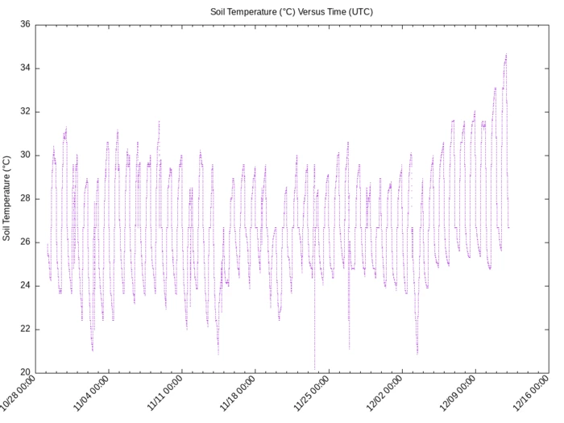

Cannabis (Someday)
==================

There is no God.

Four months resulting in three jars.  It could all fit into one jar, but I want
to keep the strains separate.

The most promising product is from the NYC Diesel plants.  It smells vaguely of
lemon gasoline and will catapult your mind into diamond-grinding rumination.
It will also give you bronchitis, because it was harvested prematurely, dried
too quickly, and has not yet cured.  It will probably never cure.

The other stuff smells like hay.  Maybe I'll bake cookies with it.

Relative humidity is a funny thing.  Actually it's not funny at all.  Nothing
is funny.  Life is pain.

Since our [last installment][1], I re-potted each plant into its own small
container.  The Grape Ape plants (left) took to their new homes immediately,
springing back to life with a growth spurt.  The $100 O.G. plants (center) took
longer to acclimate but also eventually thrived.  The NYC Diesel plants (right)
looked like they were going to stay lanky and spent, but after a few doses of
nutrients by soil and by spray, they too perked up.

I planted some spicy peppers in solo cups, to make better use of the lights.
They all died.

After a while, the plants had grown taller and largely healthy.  They had been
receiving eighteen hours of artificial light per day, followed by six hours of
darkness.  Kept this way, the plants will continue to grow indefinitely,
without ever trying to reproduce.

The stuff that gets you high occurs with the highest concentration in sticky
resins secreted by the female sex organs in their fruitless attempt to capture
pollen.

Cannabis has been selectively bred by humans to produce "flowers" that are:

- unnaturally large
- unnaturally sticky
- unnaturally psychoactive

It's all very unnatural.  But organic!  It's not a big truck.

Outdoors, cannabis will switch into reproductive mode ("flowering") when there
is less than thirteen hours of sunlight each day.

Indoors, we change the timer on our lights to be on for twelve hours and off
for twelve hours.  The plants don't know the difference, they're so stupid.

Cannabis doesn't survive Winter, so the shortening photoperiod tips off the
plant to its impending death, which it copes with by ramping up cannabinoid
production as a side effect of attempting to reproduce.  Bless them.

Before the plants go full on and get really into sex mode, you have to bend
them over and tie them down.

The change in photoperiod sets off a hormonal change in the plant that will
eventually cause it to focus most of its energy on sex organ enlargement.
However, the first phase of that hormonal change instead stimulates the plant
to suddenly grow taller.  The plant can roughly double in height over the first
week or two of the reduced photoperiod.  This is called "the stretch."

My guess is that if you reproduce by catching sperm in the wind in a forest,
your chances are improved if you're above the brush.

What it means for indoor growers is that you're going to run out of room, or
your lights are going to burn your plants, or whatever.

So we tie those girls down.  As close to ninety degrees as you can manage,
which is nerve-racking, but doable.

Cannabis plants are [apical dominant][2], which means that the highest point on
the plant undergoes the greatest growth.  What is the highest point on the
plant when you've bent it sideways?  The plant cannot decide, and so it
stimulates growth in all of the nodes fully exposed to light (until one becomes
dominant).

The point of plant bondage is to continually thwart apical dominance.  Every
time an eager branch breaks the mold, tie it down.  The result of a few weeks
of this so-called [low-stress training][3] is a shorter, bushier plant with
multiple bud sites that will one day grow into giant chunks of weed.  If you
don't train the plant, then you end up with one giant chunk of weed at the top,
and not much elsewhere.

In my case, I was going to run out of vertical space unless I trained the
plants.  So I tied them down against their wishes.

After a few weeks of reduced photoperiod, I saw flowers beginning to develop.

Those white "hairs" grow long and then fill in at the base with sticky, spongy
flower tissue.  Then the hairs turn reddish brown and curl flat onto the
flower.  The result is weed.

I can't show you what ready-to-harvest weed looks like, because around when
that picture was taken, the plants began to ail.  It's natural for cannabis to
shed leaves and show autumn colors towards the end of their flowering
period, but these plants were aging too soon, and without having put on any
weight of flower.

Then I left the plants for a week without water, and because I did not leave a
window cracked open, the building's steam heat cooked the plants to death and
dried them to a crisp right in their pots.

Problems began before then, though.  At one point, I discovered
[symphylids][4] crawling through the soil of one of the Grape Ape plants.
Symphylids look like centipedes, but rather than preying on insects, they
eat the roots of cannabis plants, which then nearly always die.  After a
soil drench with permethrin, I didn't see them anymore.

When I disposed of the plant roots today, I noticed green pockets of what I
assume to be mold.

There was also the problem of low humidity.  Here's a picture of a hygrometer
in the grow space before I left for a week:

88°F and 26% [relative humidity][5].  That's an oven.  Flowering cannabis
plants like it somewhere in the 70s and 50% relative humidity.

The temperature problem can be alleviated with better air circulation, and the
humidity can be increased with a humidifier.  Then the problem is that the
increased airflow makes the humidifier ineffective.  The grow space would
start at around 30% relative humidity.  Then I would have a humidifier billow
clouds of water droplets into the air for twenty-four hours.  The grow space
would end up at around 30% relative humidity.

I might be able to solve both the heat problem and the low humidity problem
with something called a [swamp cooler][6], but really I think that the
underlying problem is the location of the grow space.  It's at the top of a
high ceiling in the back of an apartment with no ventilation, and is under
intense light.  Even before I had the grow setup, my bedroom could be ten
degrees warmer than my kitchen.  I would need yards of winding ductwork and a
powerful inline fan to move enough air to keep that space cool.  I might as
well run a snowblower in my bathroom.

Woe is me!

Though this crop was an exercise in waste and failure, it was not without its
lessons:

- Get your soil mix correct to begin with.
- Start plants in small containers, and gradually up-size them as they grow.
- Use pH-adjusted dechlorinated water.
- Make sure there is adequate light.
- Fertilize the plants periodically.  Some strains need more than others.
- Don't leave your plants to die in a fucking oven.

It's all about the roots.

While I mull over what to do about the temperature and humidity in the grow
space, I'll start some new seeds germinating.

Better luck next time.

[1]: ../cannabis-3
[2]: https://en.wikipedia.org/wiki/Apical_dominance
[3]: https://en.wikipedia.org/wiki/Cannabis_cultivation#LST'ing
[4]: https://en.wikipedia.org/wiki/Symphyla
[5]: https://en.wikipedia.org/wiki/Humidity#Relative_humidity
[6]: https://en.wikipedia.org/wiki/Evaporative_cooler
