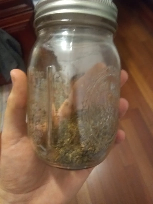

Cannabis Cookies
================

I made weed cookies.  They're devastating.

The basic idea is to dissolve weed's active ingredients into butter, and then
use the butter to bake cookies.

But first, you have to turn this:

into this:

The first molecule ([tetrahydrocannabinolic acid][1]) won't blow your mind, but
the second molecule ([tetrahydrocannabinol][2]) might.  You can convert the
first into the second by removing the `COOH` group attached to the rightmost
ring.  It's called [decarboxylation][3], and will happen eventually given some
heat.

When you smoke weed, the _fire_ supplies the heat for the reaction, but these
cookies will not be on fire, so we have to do something else.

<figure>
  
  <figcaption>THCA (A) and THC (B) concentrations over time with heating (<a href="https://www.ncbi.nlm.nih.gov/pmc/articles/PMC5549281/">source</a>)</figcaption>
</figure>

I went digging through my plastic bag of stems and whatever else was left over
from harvest, picked off what flower material I could, ground it up in an herb
grinder, and put it into a mason jar.

You can do this in the oven, but I prefer an odorless, zero-oversight,
overnight approach.  So, I filled my slow cooker with water.  After sealing the
jar tight, I placed it on its side in the water.  Then I turned the slow cooker
on "high" and went about my business.  When later I saw that the water was
nearly simmering, I turned the setting down to "low" and went to bed.

The next day, I used some tongs to pick the hot jar out of the slow cooker, and
set it on the counter to cool.  After a while, I opened it for a sniff.  Smells
like oregano, or something that'd be in a tomato sauce.  It was surprisingly
pleasant and un-dank.

Ok, butter.  But first, we need a cookie recipe.

Google brought me to reddit, and reddit brought me to this [2017 recipe][4],
which is hailed "reddit's best cookie recipe."

Here are the ingredients:

- 2 cups + 2 tablespoons all purpose flour
- 1 teaspoon baking soda
- 2 teaspoons cornstarch
- 1 teaspoon salt
- 1 ½ sticks (6 oz) unsalted butter, melted and cooled
- 1 cup dark brown sugar, lightly packed
- ½ cup granulated sugar
- 2 large eggs
- 2 teaspoons vanilla extract
- 1 1/2 cups dark chocolate chips, plus more for topping

I followed the recipe exactly, except that I first modified the butter to make
it adult-only.

Stir the ground cannabis into the melted butter, and let it just barely simmer,
covered, for like an hour.  I read multiple recipes for "cannabutter" online,
and their cook times varied from a couple hours to a couple days.  Longer is
probably better, but on the other hand:

- The weed was already thoroughly decarboxylated (probably).
- THC evaporates at 311°F, which is below the smoke point of butter.

<figure>
  
  <figcaption>butter right after having the cannabis stirred into it</figcaption>
</figure>

<figure>
  
  <figcaption>cannabutter after a little cooking</figcaption>
</figure>

<figure>
  
  <figcaption>cannabutter after an hour of cooking</figcaption>
</figure>

Once the cannabutter was done cooking, I used a cheesecloth to separate the
butter from the herb.

Now it's time to make cookies.  I added the sugars to the hot butter and
stirred until they dissolved as much as they would.  This also cooled the
butter down to near room temperature.

It looked like there wasn't enough moisture, but after mixing in two eggs, the
salt, and the vanilla extract, the wet side was wet.

Then I gradually stirred in the dry ingredients until I had a dough.  Then I
folded in the chocolate chips and was ready to start shaping cookies.

Each cookie is a ¼ cup scoop of dough rolled into a ball and then squished
slightly onto the baking pan.

I preheated the oven to 350°F and baked the cookies for 12 minutes, et voilà!

Suggested serving size: ½ cookie.

[1]: https://en.wikipedia.org/wiki/Tetrahydrocannabinolic_acid
[2]: https://en.wikipedia.org/wiki/Tetrahydrocannabinol
[3]: https://en.wikipedia.org/wiki/Decarboxylation
[4]: https://www.reddit.com/r/FoodPorn/comments/7k84bc/its_taken_a_ton_of_testing_to_get_here_but_these
