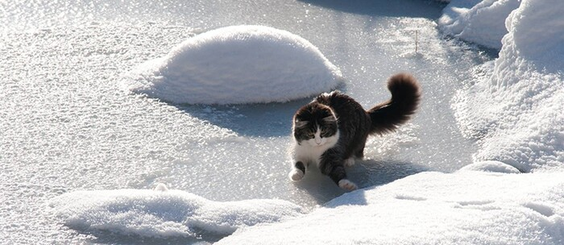

Europe, Day 1
=============

*Vineet copes with the low coefficient of friction in Iceland.*

Morning from the North,

Vineet and I got in just before midnight Iceland time last night. Immigration
was about five seconds in and out, and there was no customs. I bought some of
their funny money, which looks like other funny money I’ve seen. It’s not
green and it comes in large denominations.

Then the rental car guy put us and a few other Americans into a van and drove
five minutes to their lot, where we coughed over some more money and got into
a nice Korean SUV thing (an unexpected upgrade from what I had booked), and I
drove it on the wide, empty, Icelandic highway for less than an hour until we
reached the capital. The Airbnb place where we’re staying this and last night
is a nice, large, two bedroom apartment with a space-age shower and bizarre
power outlets. Vineet and I are in room 2. Just met the couple from room 1
this morning. They’re nice, but they talk funny. *I think they’re English*.

Body clock has no idea what’s going on. I guess the time difference is not so
bad. Going to drive around The Golden Circle today. I think the rental guys
might not have given us the promised full talk of “petrol,” which I presume
is a more expensive word for gasoline.

For those of you stalking along at home, we are currently here:

https://www.google.is/maps/place/Reykjav%C3%ADk/@64.1369699,-21.8860857,11.43z/data=!4m5!3m4!1s0x48d674b9eedcedc3:0xec912ca230d26071!8m2!3d64.1265206!4d-21.8174393

DNS insists on bringing me to Icelandic websites. Don’t they know who I am?
