Europe, Day 13
==============
I'm aboard the Arlanda Express, on my way towards a nine hour flight.
Fortunately, in addition to being an airplane, the vessel will be also a
time machine, so I'll arrive in New York only two hours after departing.

We stayed just outside of central Stockholm at a friend's apartment, which
has a balcony whose view is this:

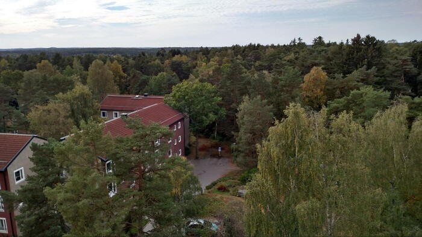

Our host looks like this:

The first full day he took us around in his car to see some scenic areas of
Stockholm:

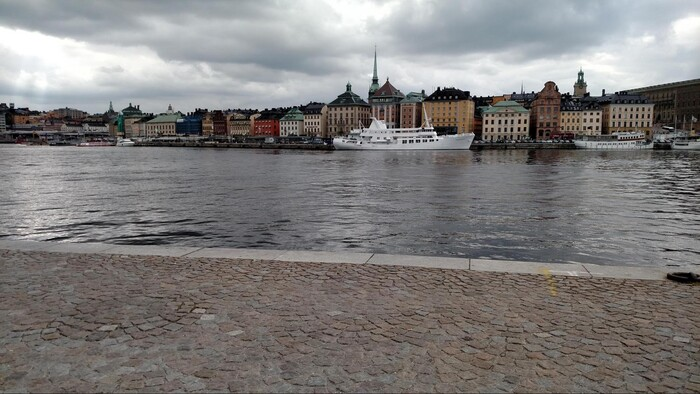

and we went to a museum about this old boat they found buried in the ocean
and managed to restore with 98% of the original material. There were floors
in the museum on things like the curing process used in the waterlogged
wood, the skeletons of the crew, and a bunch of other interesting stuff that
you wouldn't expect to find explained in such detail. I rather liked it. The
boat itself is gigantic:

The following day we drove out to a boat to take a ferry to one of
Stockholm's many islands. It was a nice ride:

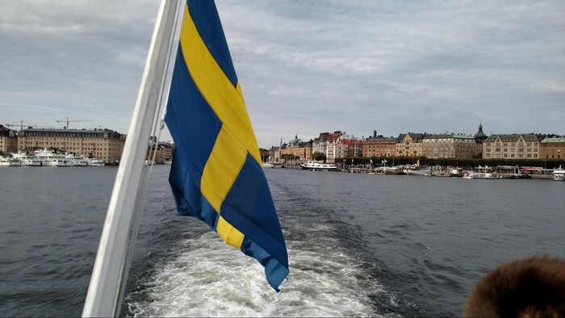

Once on the island, we took a cable barge to a smaller island where there's
an old fort:

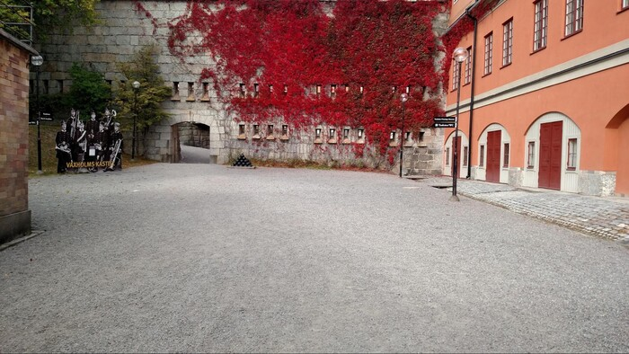

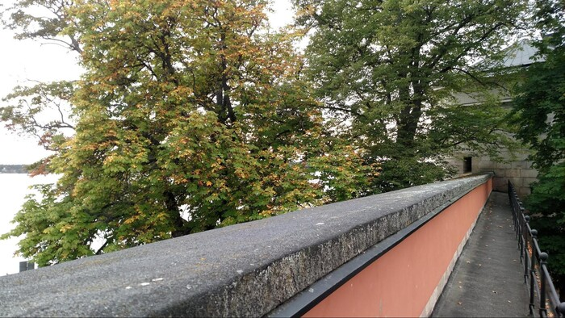

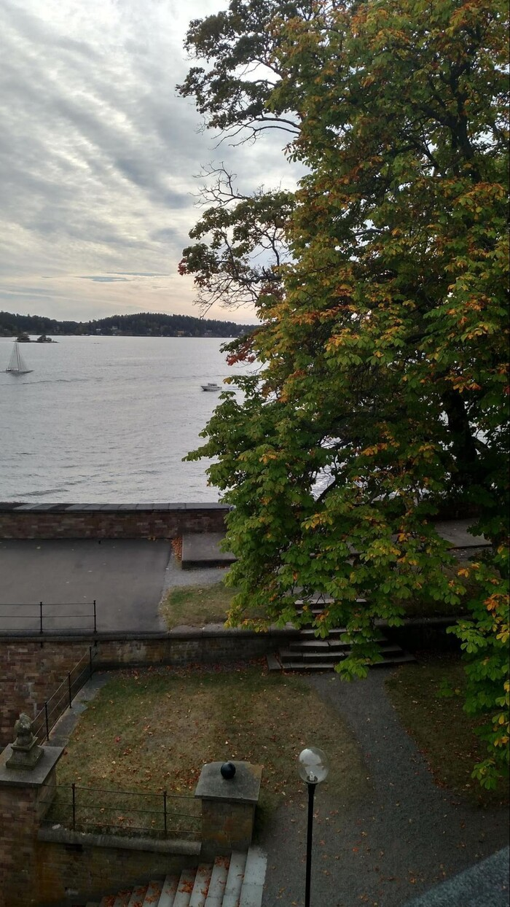

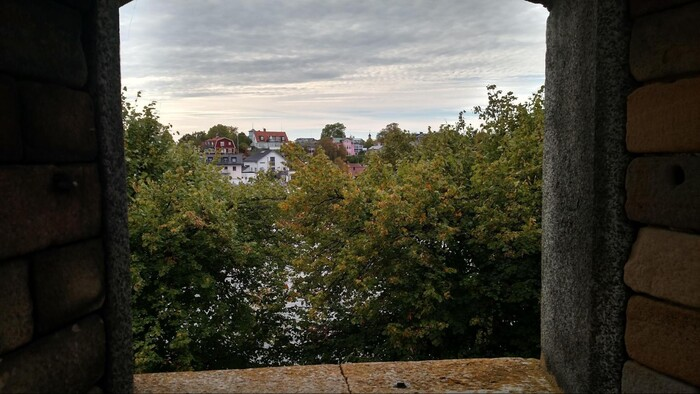

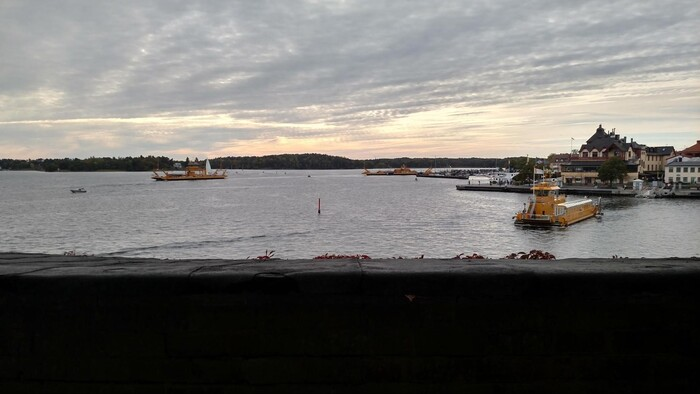

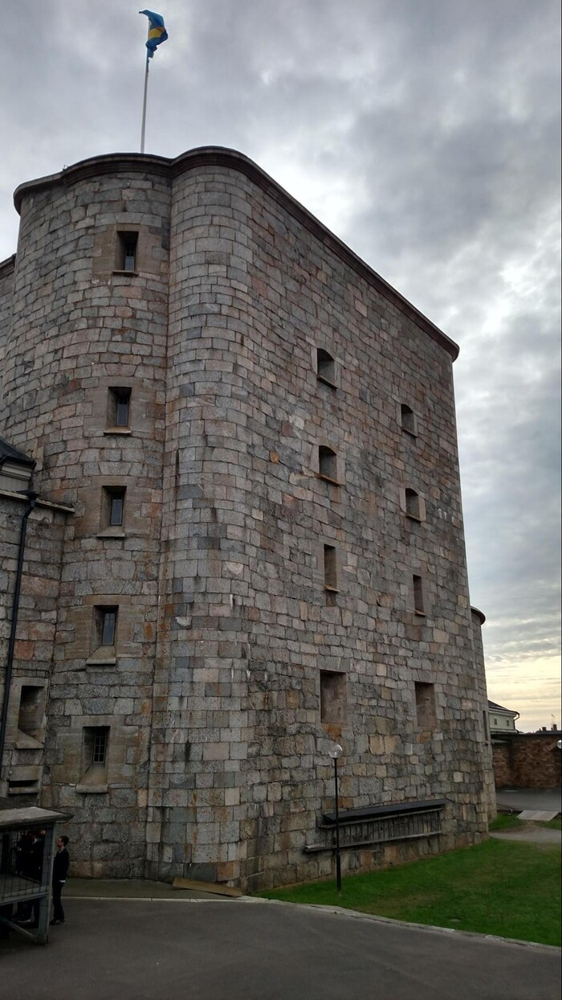

Hobbits live there:

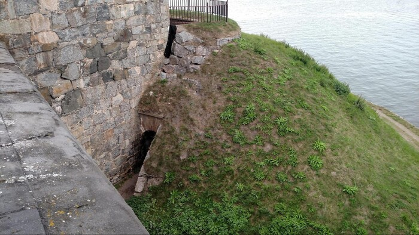

Then we took the ferry back around sundown:

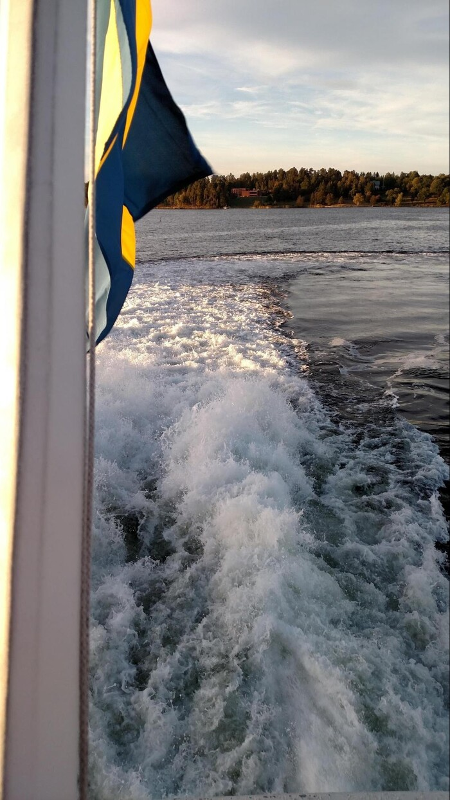

and headed into a pub in the city center to watch the "Sweden versus Europe"
world hockey semi-final. Sweden lost. C'est la vie. The city looks nice at
dusk:

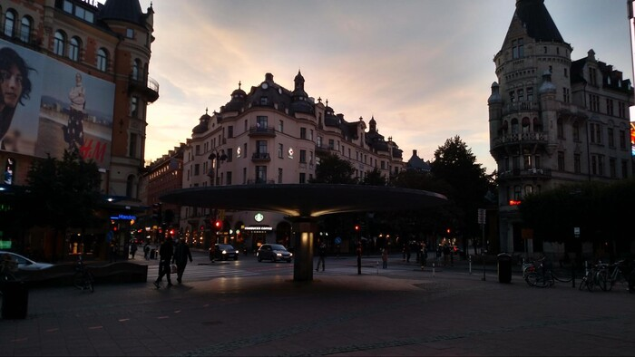

and they have balloons:

I have so far resisted the cesspool of disease otherwise known as Vineet,
but we'll see how I fare waking up for work tomorrow. Ciao.
