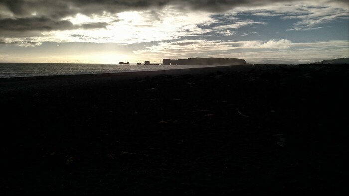
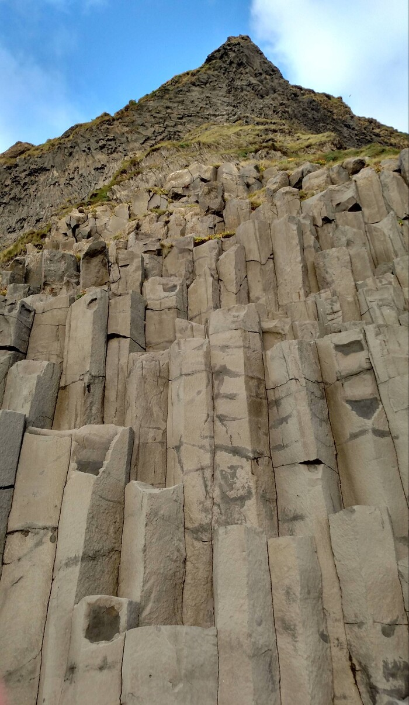
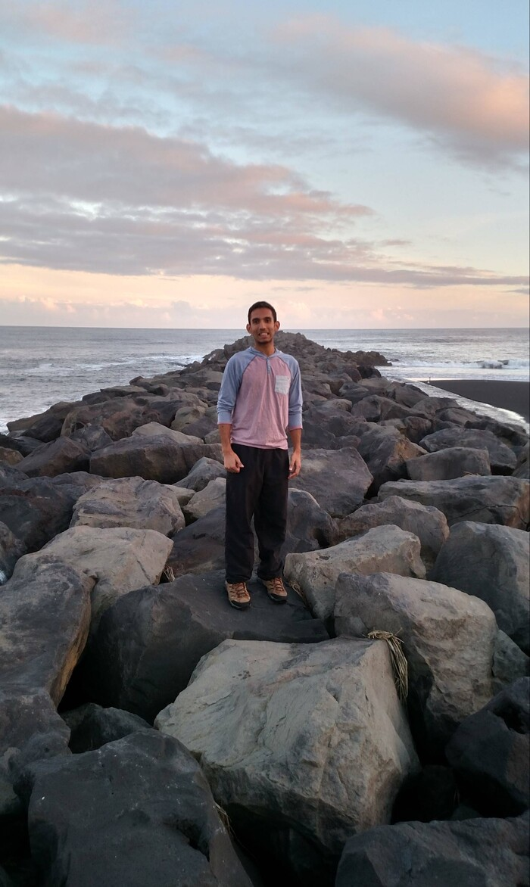
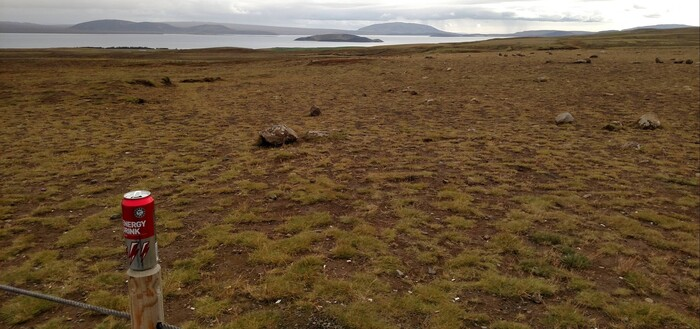
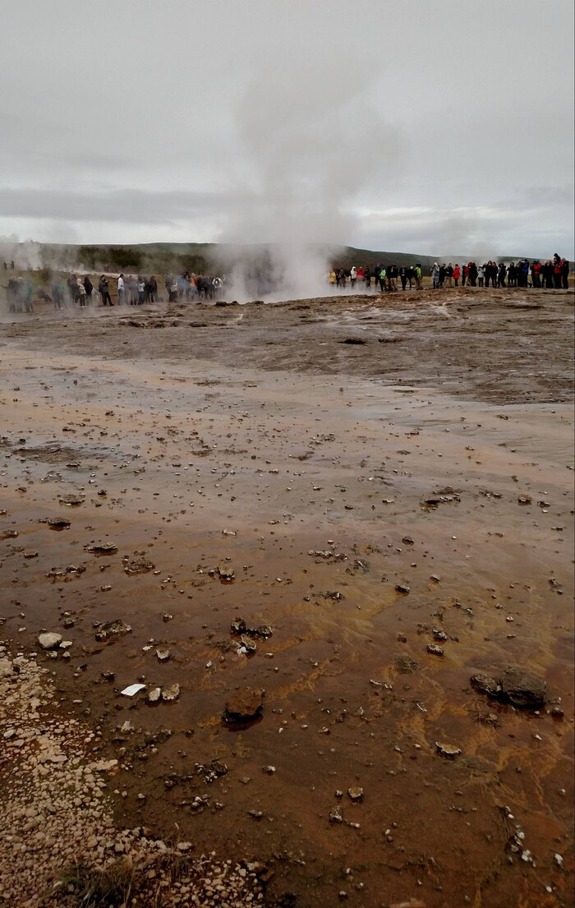
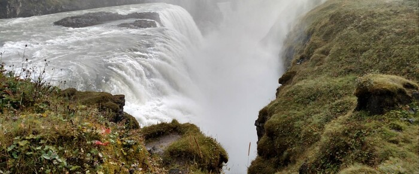
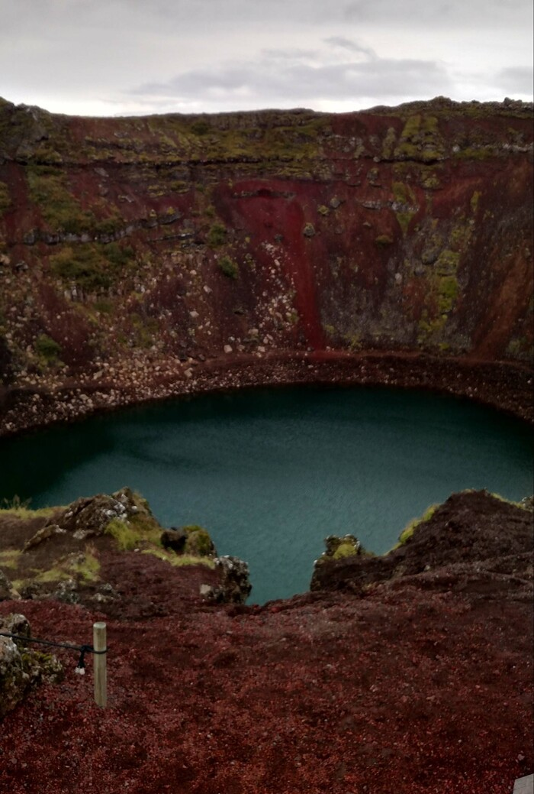
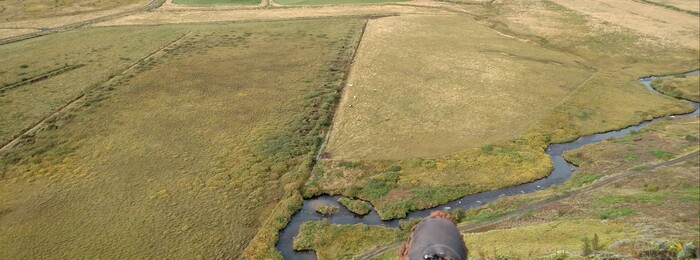
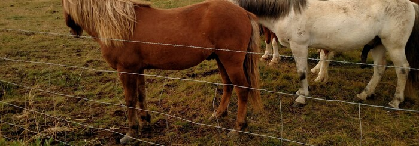
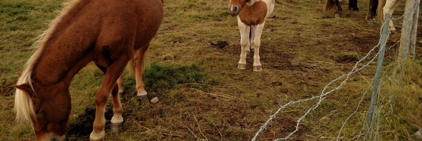

Europe, Day 2
=============
Today's cool thing was a glacier hike. You know, hiking on a glacier. A
fucking glacier. Strapped crampons onto our feet, helmets on our heads, and
walked up onto hundreds of meters of solid ice as it was melting. We walked
down into a cave eroded into existence by melt water. Everything was made of
ice. The walls like wet blue glass sparkling with starry air pockets. Ice
for miles. 

I don't have any pictures of that yet, because they were taken on Vineet's
phone.

Nanny nanny boo boo, stick your head in doo doo.

We saw also a beach with black sand and strange rock formations. The sun was
setting behind this sort of wall of stone, and the picture really doesn't do
it justice. The setting sunlight painted the structures gold, LIKE THE HALLS
OF VALHALLA!!!

 

You really would need multiple exposures combined to see what it looked
like.

Anyway, strange rocks:

 

This is what Vineet looks like when he's not falling to his death:

Mountains in the distance to your right (where the glacier is) and the ocean
to your left:

https://drive.google.com/open?id=0B6rp2WsQNNAlVzVVOTBTWjVXTW8

And did I mention yesterday? No? Well that involved energy drinks,

 

geothermal ejaculation,
 

*\[2020 note: this picture was cropped badly due to file corruption.\]* 

waterfalls,

*\[2020 note: this picture was cropped badly due to file corruption.\]* 

a lake formed in a volcanic crater,

*\[2020 note: this picture was cropped badly due to file corruption.\]* 

and sometimes climbing to the top of a hill to sit and listen to the creek
and look at the horses.

*\[2020 note: this picture was cropped badly due to file corruption.\]* 
 
We're at a hostel-like hotel in "Hella" now after having gone to "Vik" for
dinner. Cod stew. Tomorrow we drive over towards the airport to stay at the
Blue Lagoon, which is a spa. Maybe I'll drop 100 euros on a massage. Then
another Airbnb near there and off to the airport Tuesday to return the car,
and then we're LONDON BOUND.

You want to see more cats? Me too:

*\[2020 note: these pictures are cropped badly due to file corruption.\]*  
*\[2020 note: my God, look at the cock on that one.\]* 

These are the true Icelanders. The humans are kept alive only to act as
caretakers in their intergalactic communist utopia.
