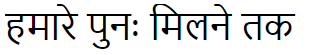

India, Day 13
=============

One of the unsung advantages of having acute diarrhea is the ability to use the
little flush button instead of the big one.  As you can imagine, I've been
spending plenty of time reading about the properties of loperamide.  For
example, did you know that in addition to slowing the activity of the bowel,
loperamide also "increases the tone of the anal sphincter"?  It's not as
exciting as it sounds.

I'm grateful for the chemically enhanced tone, though, because I think that
I have never had an experience more primal, more urgent, more deeply spiritual
and foundation-shaking than the five hour ride from the Kochi airport to our
hotel in the mountains.  I discovered new things about nature, pain, control,
perseverance, the human condition, and my anus.

<!-- Munnar Alleppey -->

I regretted not having packed a spade (or a gun), it was that bad.  I'm
currently rather medicated, but I think the worst is behind me anyway.  Enough
about that.

I'm on a boat!  But first, the mountains.

That's the view from my room.  _My_ room.  Here's the view from the shower.

Yes, the shower.  Maybe it's so that you can get natural light into the
bathroom during the day, or maybe people in Kerala like to watch each other
wash.

We got a tour of a tea factory, but photography was not allowed inside.  It's
a shame, too, because the facility was way cool.

Next to the factory was a "museum".  The items exhibited included:

- a brick
- a porcelain bathtub
- a VCR
- an aspee bolo motorized knapsack mist blower cum duster

What, you think I made one up?

There were some nice views from the factory grounds.

With Asha for scale.

On the way to the hotel, we stopped for lunch at an outdoor restaurant.

Was I inoculated here?  Or was it the dumplings I had some hours earlier at the
airport (they at least were freshly boiled)?  I don't know, but when the owner
saw my confusion as I looked at my plate, he asked "serve?"  I said, "no, I
need a fork."  This seemed new to him.  He hurried to the back and I saw him
digging through something and then what looked like vigorous rubbing.  Should
have eaten with my hands.

Munnar is a heavily wooded jungle-like mountainous area.  The roads are
treacherous and the beauty is extreme.  Clouds float at arms length in the
valleys below, and occasionally rise to engulf everything in a thick fog, which
depending on whether the sun is shining, is either a cool mist or an intense
sauna.

Here is our driver, Arun, and one of our traveling companions, Shaun (and some
other guy):

Arun stopped at a couple of waterfalls by the roadside.

Leave no stone untrashed.

The area surrounding the hotel is all tea plantations.

That's what tea looks like.  Now you know.

One of our activities was to walk up a hill in a national park.  Something
about an endangered antelope deer thing.  Didn't see any.  It was raining,
though, which allowed more interesting pictures.

Bear in mind that if I were to relax even for a moment, dark toxic sludge would
explode into my pants.

Here's a cat.

Our last stop was fittingly a dam _about to burst_:

We got back to the hotel before 7 PM, and I immediately slept.  I woke up at
midnight, drank some water, and slept again until 6 AM.

The view in the morning is even better.

Then it was another five hour drive, this time into the backwaters.

