Mexico, Day 13
==============
It's laundry day again.  This time I included two bath towels, so now all of
my clothes are covered in white lint.

Aguascalientes doesn't fuck around with its sunsets.

 <!-- mirror sunset -->

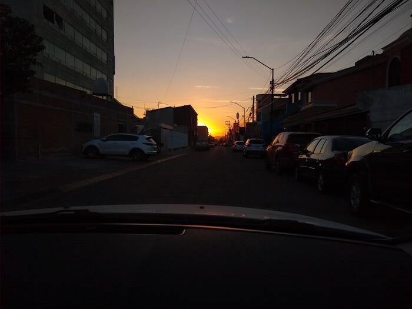 <!-- street sunset -->

Yesterday, Grace, her parents, and I visited the town of [Calvillo][1].
Manuel drove us down from the stratosphere and across swaths of
characteristically Mexican landscape.

 <!-- road -->

 <!-- more road -->

Calvillo has narrow streets lined with brightly colored buildings.  Some of
the streets (not pictured) were steeply inclined and reminded me of San
Francisco.

 <!-- Calvillo street -->

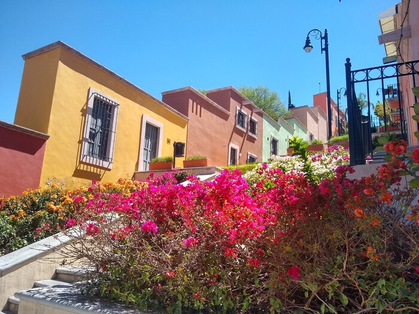 <!-- Calvillo colors -->

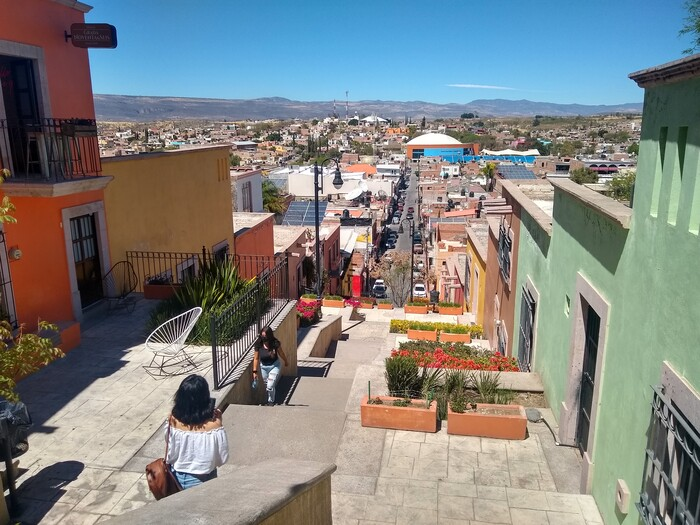 <!-- Calvillo view -->

We stopped for lunch at a nice outdoor restaurant attached to a hillside hotel.

 <!-- drinks -->

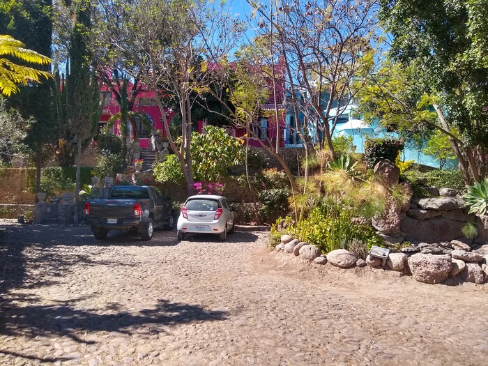 <!-- hotel -->

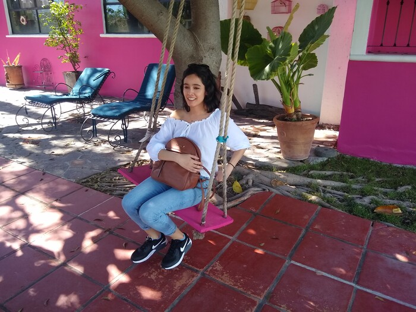 <!-- Grace swing -->

For a desert-dwelling Mexican, Grace does not much tolerate hot weather.  She
prefers a vampiric lifestyle.

I've been eating food, can you believe?

That morning I fried some leftover bacon for breakfast.

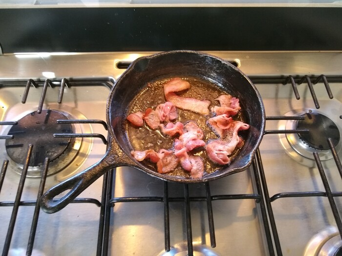

Previously, madre Graciela had prepared Manuel's favorite dish for us:
[chile relleno][2].  They are distantly related to the stuffed bell peppers
that my mom used to make, except fried with egg whites and filled with
minced meat.

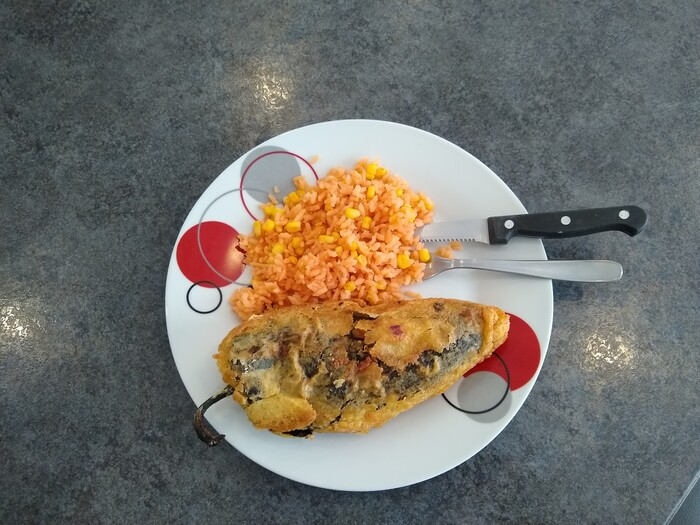

Grace and I cooked a pasta/chicken/eggplant recipe of hers. There is still
some left over...

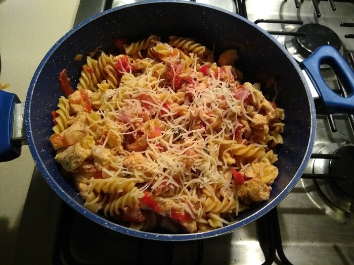

I improvised some chicken-with-leeks-over-pasta dish.  I got the wrong cut of
chicken from the supermarket, but it was edible nonetheless.  Grace had never
had leeks before.

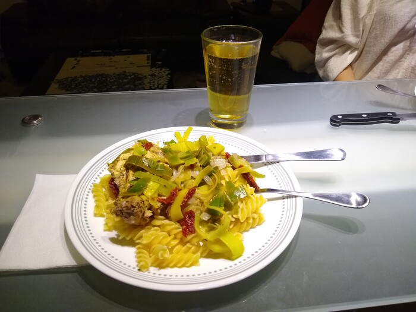

I also cooked a big batch of my [chicken stew][3] last night, but I don't
have any pictures.

There's a tiny sorbet store of great renown near Grace's parents' place. She
got strawberry and I got tamarind.

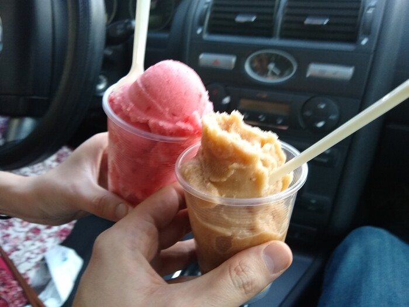

The real culinary innovation of the trip so far is how to eat fruit.  In Mexico
there are two magical condiments that form a dyad of fruictific perfection:
[chamoy][4] and [tajín][5].  They balance the sweetness of fruit with tart,
salty, and savory goodness.  Grace's favorite is on mango.

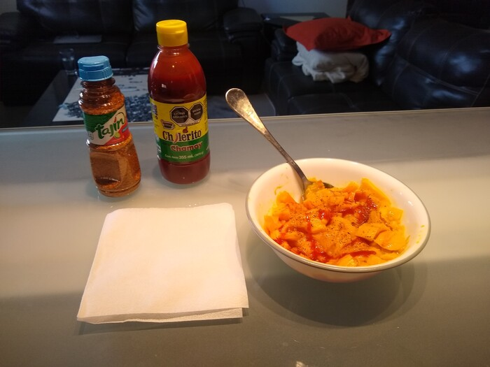

Here she is looking smug about her preparation of pineapple.

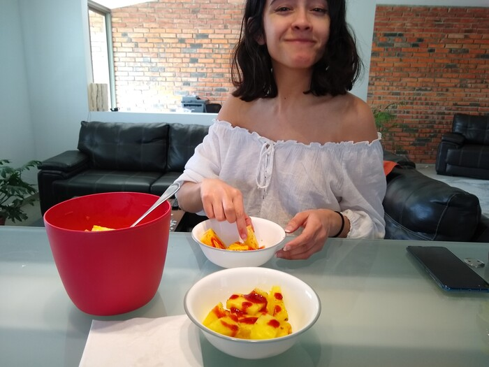

Speaking of food, it's one o'clock here and I haven't eaten today.  Let's put
that microwave to use.  ¡Adios!

[1]: https://en.wikipedia.org/wiki/Calvillo
[2]: https://en.wikipedia.org/wiki/Chile_relleno
[3]: https://www.littlebroken.com/one-pot-chicken-stew/
[4]: https://en.wikipedia.org/wiki/Chamoy
[5]: https://en.wikipedia.org/wiki/Taj%C3%ADn_(seasoning)
