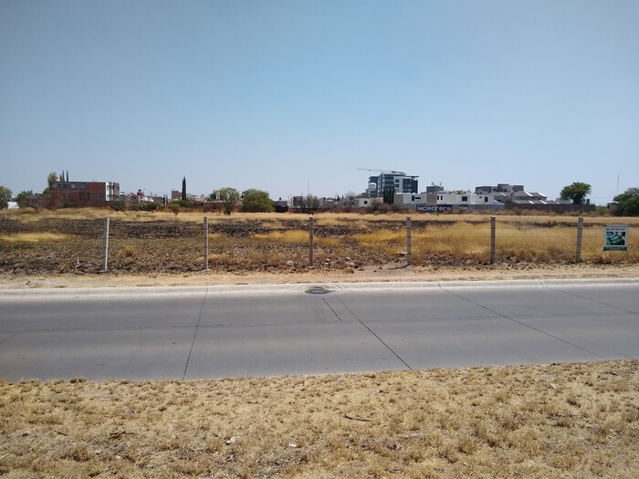

Mexico, Day 29
==============

 <!-- horse -->

If you zoom in (click), you can see a horse above the third post from the left,
in the center of the image.  My first few days in Aguascalientes, this horse
shamelessly presented itself near the fence.  I'll take a picture another day,
I said.  I'm in a hurry, I said.  Then the horse disappeared for weeks.
Imagine my concern.  When it finally returned, it stayed far away from the
road.  This is the best I could manage without venturing into the pasture.  I
can't help but wonder what might have been.

I'm sitting in another Aeromexico commuter jet, just having walked onboard
from the tarmac.  When I first arrived, there was a beautiful sunset behind the
mountains on the horizon past the runway, but in my fluster I didn't photograph
it.  This time around all we get is a view of the dusty distance.

 <!-- tarmac -->

As compensation, here is another sunset.

 <!-- sunset car -->

I invited Grace's parents over to the Airbnb for dinner.  Here we are having a
dessert of pineapple and mango with chamoy and tajín.  The main course was
again Grace's sun-dried tomato chicken and roasted potatoes, and my chicken
stew.  This time I put a little wine in the soup; I think it worked well.

 <!-- Penillas -->

 <!-- chicken and potatoes -->

 <!-- soup -->

Grace saved the street food for the end of the trip.  Last night we went
driving in search of "street corn," or "elote," or "chascas."  Because it was a
notable historical figure's birthday, and because it was Sunday, most of the
street corn vendors were closed.  But not this one.

 <!-- chascas stand -->

I ordered... something.  It looks kind of like what I imagine the inside of an
animal looks like.

 <!-- chascas food -->

It's primarily corn, but there's also cheese and bacon and mushrooms and stuff
_there's so much stuff_.

As if that weren't enough (Grace got a smaller dish), we ordered tacos when we
got back home.

 <!-- tacos 1/3 -->

 <!-- tacos 2/3 -->

 <!-- tacos 3/3 -->

Tacos!

That's about it.  I checked my bag this time, because it now contains a cast
iron skillet (never leave a soldier behind) and a bottle of tequila.  Since you
were wondering, here's the accumulation of a month's worth of grocery
shopping.

 <!-- kitchen stuff -->

I kept the skillet and the tequila glasses, but the rest is for the next guy.
Except the pepper.  Grace's mom got the pepper.

We in no way finished the puzzle.

 <!-- puzzle -->

Ahora, a Nueva York.

<table class="series">
  <tr><th colspan="5">Mexico</th></tr>
  <tr>
    <td><a href="../site/mexico1.html">Day 5</a></td>
    <td><a href="../site/mexico2.html">Day 8</a></td>
    <td><a href="../site/mexico3.html">Day 13</a></td>
    <td><a href="../site/mexico4.html">Day 21</a></td>
    <td>Day 29</td>
  </tr>
</table>
