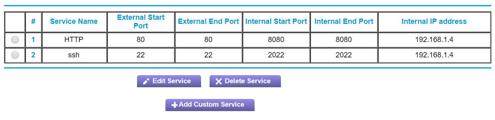
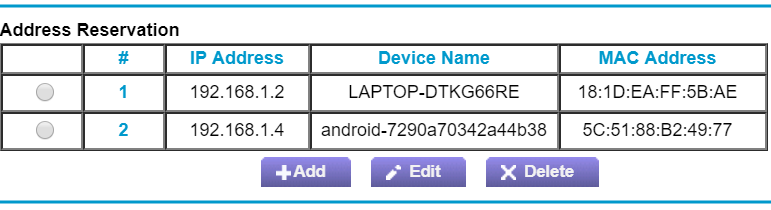
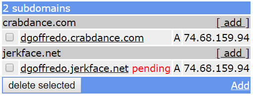

Phone Server
============
I turned my old Android phone into a web server.  Here's how.

Verizon is Evil
---------------
I got tired of paying nearly $80 per month for my one phone line and the
less than one gigabyte of data I was using. Logging into my Verizon Wireless
account to look for a better deal, I found that the "recommended plan" for
me was one that costs even more money and allows five times more data.

After a little bit of research, I decided to try Google Fi.  The only problem
was that my aged Verizon-provided Droid Turbo does not support Google's
networks.  However, seeing that I would stand to be paying just under $30 a
month with Google, it didn't bother me to buy Google's cheapest offering, a new
Moto G6 for $100.

It was super easy.  I didn't even have to call Verizon (later on I did anyway,
just to make sure).  Google has this sorcery where you give them your Verizon
Wireless credentials and they transfer and cancel things on your behalf.

Anyway, new phone works, all is well.  But what about this old phone?  It's
practically unsellable, though it works just fine.

To be more specific, the Droid Turbo has the following specifications
(according to [wikipedia](https://en.wikipedia.org/wiki/Droid_Turbo#Specifications)):

- [Snapdragon 805 quad-core processor](https://en.wikipedia.org/wiki/List_of_Qualcomm_Snapdragon_systems-on-chip#Snapdragon_800_series)
  clocked at 2.7 GHz,
- [Adreno 420 GPU](https://en.wikipedia.org/wiki/List_of_Qualcomm_Snapdragon_systems-on-chip) (on board the Snapdragon),
- 3 GB of memory,
- 32 GB flash storage,
- 3,900 mAh battery,
- and Android 6 (Marshmallow).

That's a pretty powerful computer.  Also, if this [study](https://www.usenix.org/legacy/event/atc10/tech/full_papers/Carroll.pdf)
on the power consumption of a comparably more powerful phone is applicable,
then with the phone's mobile network radio and screen turned off, it will draw
less than one watt of power.  For comparison, a desktop computer might draw
[between 60 and 300 watts](http://energyusecalculator.com/electricity_computer.htm).
This is peanuts compared to the Flux Capacitor's minimum requirement of
[1.21 gigawatts](https://www.youtube.com/watch?v=mjCRUvX2D0E), but that's
another matter.

I have an idea!  Let's gain root access to the operating system underlying the
phone, wipe over that system with some Linux distribution having drivers
appropriate for the phone, install a web server on it, and expose it to the
internet!  Wouldn't that be fun?

No, it would not be fun.  It's not even possible, because Verizon is evil.

### The Un-unlockable Phone
I'm well out of my depth on this subject, but as far as I understand from
reading on the internet, when a phone powers up, there's a little system that
loads a program that starts up another little system that loads a program that
etc., etc. until the "real" operating system is loaded and starts running
your beloved apps.

At each stage in this process, or at at least one stage, the code whose job it
is to further the loading of the system can check whether what it is loading
is "legit," for some definition of legit.  Qualcomm even makes a special
circuit that's effectively "write-once" memory, so that you can potentially
modify such logic (e.g. to say "don't check whether it's legit") but can never
change it back.

Many phones that reach the consumer as part of a wireless service contract
(such as my old one) have their "bootloader locked" so that the "ROM" loaded to
start the system must have a certain digital signature.  This means that
you can't do anything with the phone except view advertisements and buy
merchandise.  Were you to replace the contents of the ROM with anything else,
the phone would refuse to start, or perhaps permanently disable itself so that
you can never do anything with it again (called "bricking," apparently because
at that point the phone is little more than a silicon brick).

Fortunately, phone manufacturers are not, on the whole, in the business of
limiting the capabilities of their products, and so Motorola Android phones
have a process you can use to "unlock the bootloader," typically voiding the
phone's warranty in the process.

This involves turning off the phone, turning it on in a special way (holding
the power button and the volume-down button), copying down some magical
numbers, and typing them in to one of Motorola's websites.  Then, supposedly,
Motorola looks up some secret key based on what you typed, and then you can
enter that key into your phone and, voila!  From then on your phone will load
whatever happens to be in memory, digital signature be damned.

Except that it doesn't work if you got your phone from Verizon.  The website
will tell you that "your phone cannot be unlocked."  Why?  Because Verizon
insisted on this.  Because Verizon is evil.

This phone does not belong to you, it belongs to us.  We have no more use for
it, and so neither shall you.

Life in Userland
----------------
Ok, so it's disappointing that I can't completely control the system on the old
phone, but not all is lost.  After all, Android is designed to make writing
apps easy.  I could just code up my hobby as an application, rather than having
to replace the entire system.

In fact, I don't necessarily need to write any code.  Surely somebody has
already released an [Android app](https://play.google.com/store/apps/details?id=jp.ubi.common.http.server&hl=en_US)
that makes the phone serve web pages.  So, I can just download such an app from
the Play Store, configure it to serve my static website, and job done.

Where's the fun in that?  I want the full Linux experience.  Fortunately for
me, there's an option.  It's called [UserLAnd](https://play.google.com/store/apps/details?id=tech.ula&hl=en_US).
These [wizards](https://github.com/CypherpunkArmory/UserLAnd) have leveraged a
program called [proot](https://github.com/proot-me/proot), which allows you to
"chroot, mount --bind, and binfmt_misc" without root privileges.  proot uses a
Linux feature called [ptrace](https://en.wikipedia.org/wiki/Ptrace) to trick
a running program into thinking that it's running as root in a chroot jail,
when in fact it's just being controlled by proot.

The folks at UserLAnd wrapped up proot in Android app clothes, including a
terminal emulator and [busybox](https://busybox.net/), a compact suite of Unix
tools, including, conveniently enough, a simple [HTTP server](https://git.busybox.net/busybox/tree/networking/httpd.c).

Once you have UserLAnd installed on your phone, you can instruct it to install
a Linux distribution in the proot jail, then start a "session" on that system
as a specified user with a specified password, and you're ready to go.

ssh
---
Working on the Linux command line using a phone is awful.  The first thing I
did is find out which ssh server was running on my new system and connected to
it from my laptop.  This involved me learning properly for the first time how
to use [ssh-keygen](https://linux.die.net/man/1/ssh-keygen), [ssh-copy-id](https://linux.die.net/man/1/ssh-copy-id),
and [ssh-agent](https://linux.die.net/man/1/ssh-agent).  Also, apparently
[dropbear][dropbear] exists and is an alternative to [sshd](https://linux.die.net/man/8/sshd).

The result is that I can now poke around inside my old phone from my laptop.
For example:

    david@LAPTOP-DTKG66RE:~
    $ ssh -Y david@192.168.1.4 -p 2022
    Warning: No xauth data; using fake authentication data for X11 forwarding.
    david@localhost:~$ ps -ef | head
    UID        PID  PPID  C STIME TTY          TIME CMD
    david     6995 10263  0 Jun12 ?        00:00:00 dropbear -E -p 2022
    david     6996  6995  0 Jun12 pts/0    00:00:00 -bash
    10133     7136   424  0 Jun12 ?        00:00:19 com.google.android.inputmethod.latin
    10082     9923   424  0 Jun11 ?        00:00:00 com.vzw.apnservice
    10004     9970   424  0 Jun11 ?        00:00:00 com.android.providers.calendar
    10006     9985   424  0 Jun11 ?        00:00:03 android.process.acore
    10055    10005   424  0 Jun11 ?        00:02:11 com.google.android.gms
    10055    10018   424  0 Jun11 ?        00:00:17 com.google.process.gapps
    10085    10068   424  0 Jun11 ?        00:00:05 com.telecomsys.directedsms.android.SCG
    david@localhost:~$

Alright!  Now all I needed to do is:

- `sudo apt install git`,
- `git clone http://github.com/dgoffredo/dgoffredo.github.io`
- `cd dgoffredo.github.io`
- `make`
- `busybox httpd -p 0.0.0.0:8080`

Now my phone is serving my blog at port 8080, but how do we access it from the
internet?

Port Forwarding
---------------
When you type an [IP address](https://en.wikipedia.org/wiki/IP_address) into
your web browser, the browser attempts to establish one or more [TCP](https://en.wikipedia.org/wiki/Transmission_Control_Protocol)
connections to that address on port 80.  But I'm not listening on port 80,
I'm listening on port 8080.  This is because you can't bind to ports below
1024 unless you are root.  Besides, even if I were listening on port 80, it's
my home wireless router that's getting the incoming connection. How is it to
know that it is meant to forward that connection to my old phone?

Fortunately, the [Netgear WNDR3400v3](https://www.downloads.netgear.com/files/GDC/WNDR3400V3/WNDR3400v3_UM_19June2014.pdf)
wireless router sitting by my window supports something called
"port forwarding," which allows you to say "when you receive a connection on
port X, instead forward that connection to local address Y on port Z."

So, I navigated to my router's admin web interface at `http://192.168.1.1`, and
configured the following settings:

`192.168.1.4` is the local address of my old phone, which is connected to the
router over Wi-Fi, port `80` is the port on which I can expect HTTP requests to
enter my network, and port `8080` is the port on which my phone is listening.

You'll notice I also configured forwarding for [ssh](https://en.wikipedia.org/wiki/Secure_Shell),
so that I (or, now that I've written this, almost anybody) can remotely log in
to my old phone.  Remember, though, that the system to which I'm logging in is
just a proot jail running inside of an Android app having no special
permissions.  I suppose you could erase my SD card, which would be a dick move,
but since I just reset the phone there isn't anything on it to lose.  Go ahead
and add my phone to your botnet, see what I care!

Address Reservation
-------------------
In addition to telling my router to forward HTTP requests to my phone, I also
need to tell it always to assign the local IP address `192.168.1.4` to the
phone.  Otherwise, the next time I restart the phone or the router, the phone
might be assigned a different local address (e.g. `192.168.1.5`).  The router
has another option for this, called "address reservation."

This says that any device having my laptop's [MAC address](https://en.wikipedia.org/wiki/MAC_address)
(which is just my laptop) will be assigned local address `192.168.1.2`, and any
device having my old phone's MAC address will be assigned local address
`192.168.1.4`.  So, that settles that.

DNS
---
At this point, the old Android phone sitting in my apartment and connected to
my Wi-Fi router is now accessible from the entire internet at [74.68.159.94](http://74.68.159.94),
my router's _public_ IP address.

"Seventy-four, sixty-eight, one hundred fifty-nine, ninety-four" does not have
much of a ring to it, I admit.  Sure, it's kind of like a weird phone number
that you could memorize, but who wants to do that?

It would be better if that address could be looked up somewhere using an
alternative name -- a more human-friendly name.

Fortunately, such a system exists.  It's called the
[Domain Name System (DNS)](https://en.wikipedia.org/wiki/Domain_Name_System),
and, luckily enough, there are people who own domain names and are willing to
let you use a [subdomain](https://en.wikipedia.org/wiki/Subdomain) of theirs
for free!

The service I used is called [freedns.afraid.org](https://freedns.afraid.org/).
Using this, I was able to associate the subdomains
[dgoffredo.crabdance.com](http://dgoffredo.crabdance.com) and
[dgoffredo.jerkface.net](http://dgoffredo.jerkface.net) with my public IP,
`74.68.159.94`.  So, when you type either of _those_ names into your web
browser, the browser will ask DNS "what IP address(es) is (are) associated with
this domain?"  DNS will reply "74.68.159.94," and then the browser will send
an HTTP request to the old Android phone sitting in my apartment.

FreeDNS's web interface looks like this:

That service even has a programmatic API, so in principle I could carry around
my web server it my pocket, and every time it entered a new network and was
assigned a new IP address, it could notify DNS of the new address, so that
my website remained available anywhere my old phone happened to be connected to
the internet.  Besides being a useless idea, it wouldn't even really work,
though, because I wouldn't be able to set up port forwarding on every network
that I enter.

Now What?
---------
I have no answer.

After all, I don't _need_ to host my blog from an old phone sitting in my
apartment.  It's already hosted "in the cloud" at [dgoffredo.github.io](https://dgoffredo.github.io/).
Instead, this was just for fun.

It got me thinking, though, about how we all have these powerful computers in
our pockets, connected to the internet, all day, every day.  Further, whenever
you're asleep at night, the phone is plugged into a power source, screen off,
still connected to the internet.

I looked into the idea of a distributed only-when-you're-sleeping volunteer
computing network, so that scientists could crunch the hard numbers on protein
folding and quasar searching and whatever else, at no cost to you except the
additional pennies in electricity that your phone would consume while you
sleep.

This already exists, of course.  It's called [BOINC](https://boinc.berkeley.edu/)
and there's an [Android app](https://play.google.com/store/apps/details?id=edu.berkeley.boinc&hl=en_US)
for it that does exactly what I described.  It's now installed on my old phone
server, chewing up CPU cycles looking for possible signals in
[LIGO's gravitational wave detection data](https://www.ligo.caltech.edu/).

So, hack around with your phone! It's fun, and you might learn something.

[dropbear]: https://en.wikipedia.org/wiki/Dropbear_(software)