Russia and Czechia, Day 3
=========================
Greetings from Motherland,

Come sit, for I have much to tell you. I arrive three days before, and see
many things. On first day, I take plane. It was big plane, but slow plane. I
did not sleep on plane, so when I arrive in Moscow the next day, I want to
sleep. My body think it late at night, when it Moscow it middle of
afternoon!

Gregory – papa Pasha – and Pasha pick me up in machina at airport, and we
drive to city center. Gregory speak some English, but I speak no Russian so
I like some English. Moscow big city. There are many building, mostly
apartment building. We go to flat of Ella – mama Pasha – and Ella very happy
to see Pasha. She make high pitch noise. Ella no see Pasha since seven year
ago, but they talk every week. We all eat big dinner and get very sleepy.
There is much garlic. Gregory ask if I want to visit some place, but Pasha
say no, we are tired. So we sleep very early.

Next morning I wake up at midnight, and at six, and then at eight. Ella make
breakfast of porridge and yogurt and I have apple. Ella very nice woman,
also speak some English. Then Ella go to work and Pasha and I take metro to
meet Gregory in city center. Moscow metro is large and clean. It is deep
underground for nuclear war. I no see rat and no homeless person. The
ceilings are high like cathedral.

Gregory know powerful people in Russia. One powerful person know even more
powerful person. This person sign document allow American into state Duma,
center of Russian government. Document so effective that Russians must wait
and use other entrance. American with document can use any entrance.

In Duma we meet Vladimir – friend of Gregory. No, not that Vladimir.
Vladimir work in Duma for twenty-three year. He is retired but still know
people in Duma. Vladimir gave tour to American and show offices of four
parties of Russian politics. Russian politicians on holiday, so no meet
Russian politicians. Pasha translate for American. Vladimir has much hair in
nose. He look like tooth brush! Tooth brush know much of Russian political
history. Pasha translate whole history for American.

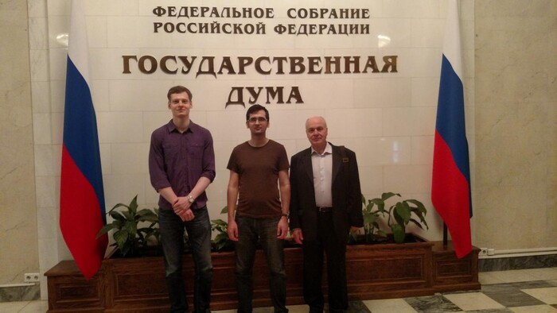

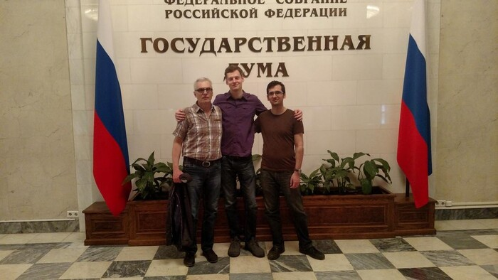

In Duma we eat lunch in cafeteria, and there is much to eat. Then we have
tea in cafe. American have trouble staying awake in Russian conversation,
but only Pasha notice.

After Duma, we go to Kremlin. Gregory and Vladimir leave, but Pasha and
American go to Kremlin. Not whole Kremlin, that for another day. We walk
through Kremlin, and go to armory museum. Armory museum have most luscious
collection of silver relics in all Europe. Audio tour say luscious many
times. It amuse American, but Pasha no understand why. Pasha is disappointed
at the size of collection. There are many rooms of items, but not as many as
Pasha expect. American tell Pasha he in New York too long.

After armory museum, we walk around Kremlin in park. It is very nice weather
and many pretty girl. American ask Pasha where ugly women in Moscow. Pasha
say we will see them. We sit on bench and get hungry and sleepy. We walk to
Red Square, where American take pictures. The sun is setting and it is very
pretty. There are many tourists. Then we go to fast food Russian pancakes
and then to outside bar cafe. Beer cost New York prices near tourist area.
Pasha says before exchange collapse, Moscow very expensive city.

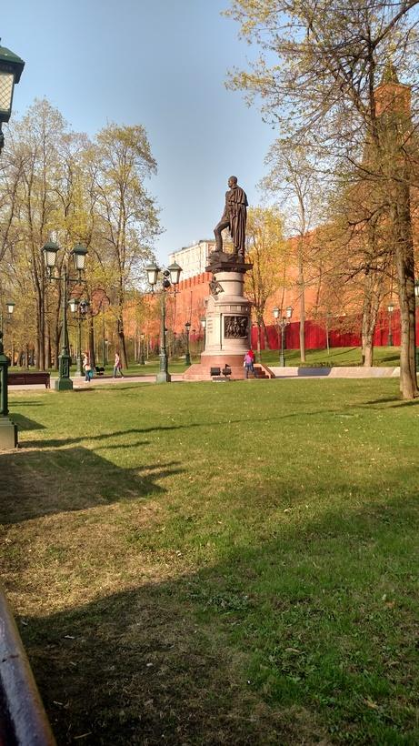

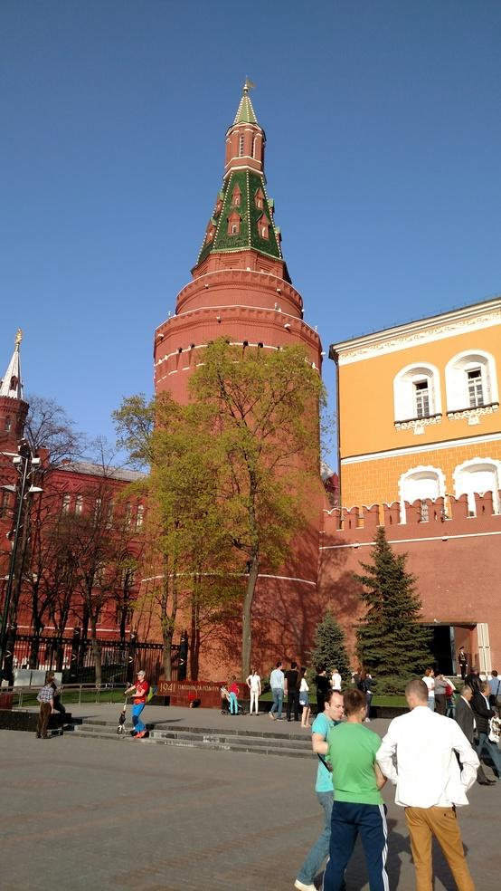

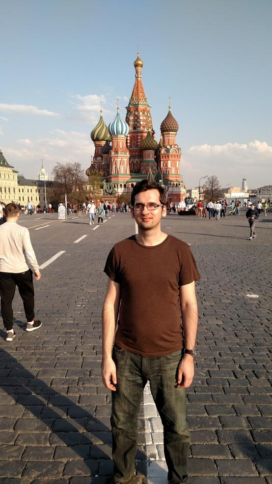

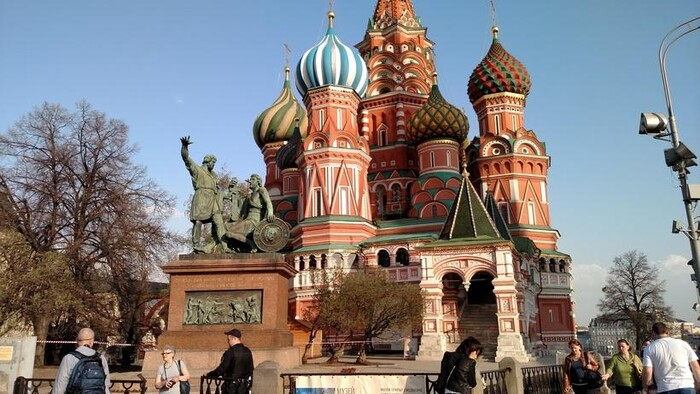

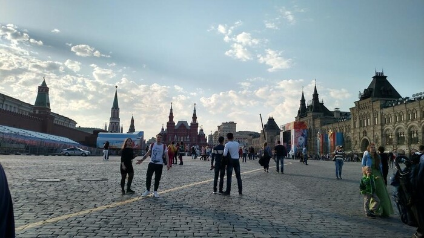

Then we walk to famous street in Moscow, like La Rambla in Barcelona. It
long walk to get there, but we pee before so no problem. There we find fancy
beer bar, and have fancy beer. Young group sit at table next to American and
Pasha. Pasha and American speak English, and group assume we no understand
Russian. This amuse American, and Pasha tell American what they say about
us.

We go back to flat of Ella, and she is worried. Midnight is late for Ella.
Pasha call Ella, but still Ella worry. Ella express worry by making soup.
Very good soup, with much garlic. We go to bed. The next day I am thirsty.

We get up early. The beer help wake up, and help in bathroom. American very
impressed. Gregory have whole day planned. Gregory very energetic man,
generous host. Gregory take us in machina to laboratory of friend. Friend
head of Russian pharmaceutical quality verification agency. He want to
retire, but there is nobody to replace him. Man wear white lab coat and
shake hand of American and speak Russian. Pasha translate for American. He
give tour of facility. There is much expensive equipment. Women working on
equipment avert gaze when man in lab coat enter room. One room has full
chemistry lab. American tell Pasha, "I love chemistry, so this is like a
playground for me." Pasha does not understand and translates roughly, "This
looks like child's play." People in lab are offended, and American does not
understand. Gregory tell American later, "this is state facility, not
private." Then American understand, and tell Pasha to clarify. Still
American think it is not clear. Later in machina American tell Pasha again,
and only then Pasha understand. American learn it dangerous to translate
subtle ideas. Still, man in lab coat did not seem offended. He show us more
expensive machines, and guinea pigs and lab mice. He surprised earlier when
American ask him how they measure toxicity using spectrographic methods
only. So man in lab coat reveal animals. Man in lab coat ask if American
parents doctors. Pasha say no, dentist. Then we have tea and cake in break
room. There we talk to Olga, H.R. of facility. American find it hard to look
directly at Olga. Olga want to be actress, but was rejected from acting
school. American tell Olga to be actress in New York. Olga laugh. American
ask Pasha where are ugly women in Moscow. Now Pasha says he does not know.
Gregory and man in lab coat left us three for conspicuously long time.

After facility, we stop at cemetery. Relative of Gregory famous actor, and
murdered horribly a few years ago. We get flowers and put them on grave.
Always even number for dead, odd for living. Do not give Russian girl even
number flowers. Cemetery have graves of many famous Russian people. There is
section for artists, and section for soldiers.

After cemetery, we stop at church to light candles for murdered actor. Pasha
say religion business, and Gregory shrug.

Next we go in machina to Moscow State University. We pick up daughter of
Vladimir as tour guide – Natalie. Natalie does not have visible nose hair
like father. Natalie's eyes like Neptune. American was hungry, but after
meeting Natalie American no longer hungry. Natalie teach dance to children
near university. She speak a little English, but travel much. We go to
university building, big building. We can no enter building without pass,
and cannot get pass, so we walk around campus. Moscow State University have
very nice campus. Pasha tell American next time Pasha in Moscow, he stay
near university.

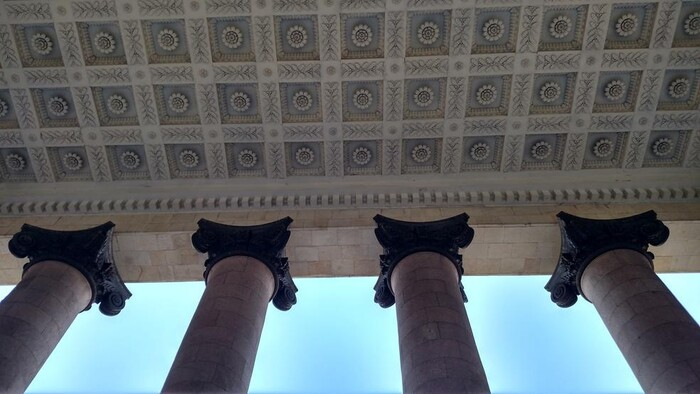

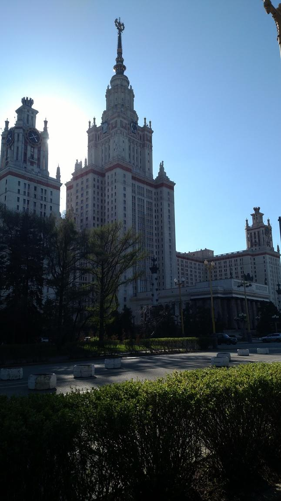

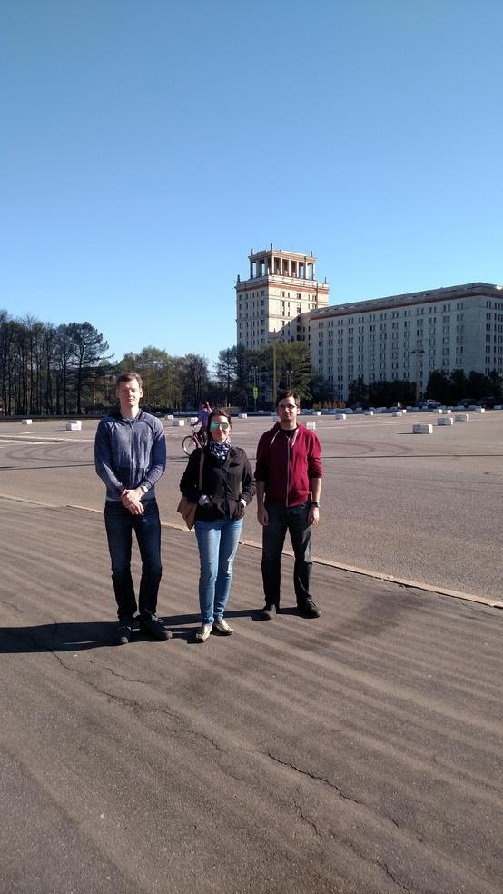

Gregory buy everyone business lunch at restaurant near campus. American and
Pasha have rubles, but Gregory insist. Gregory order for American all
classic Russian foods. Then we walk back to car and drop off Natalie.
American very sad. Gregory insist that Natalie give email address to
American and Pasha, so we can send pictures we took. American start to think
Gregory very smart man.

After university we go in machina back to flat of Ella, but there is much
traffic. Victory Day on May 9 commemorate destruction of Nazi in Second
Great War. Russians rehearse parade, and so there is much traffic. Gregory
hate Moscow traffic.

Before flat of Ella, Gregory need to do something for work. Gregory drop off
American and Pasha near giant television broadcast tower. Near top of tower
there is observation deck, cafe, and restaurant. Cafe and restaurant rotate
around tower once every forty minute. There is no room in restaurant, but we
go to observation and take pictures, and have beer in cafe. American like
view from tower. Many good picture of sun setting from tower. After tower,
Gregory return with machina and take us back to flat of Ella. American very
tired and we sleep.

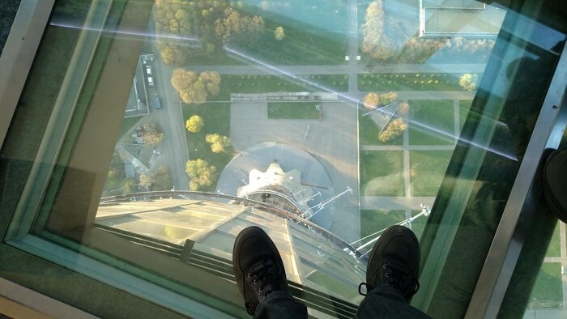

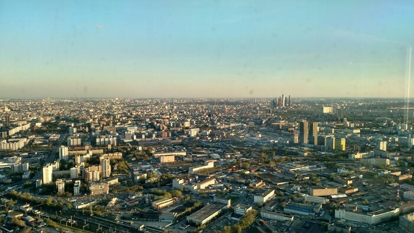

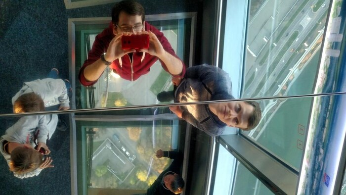

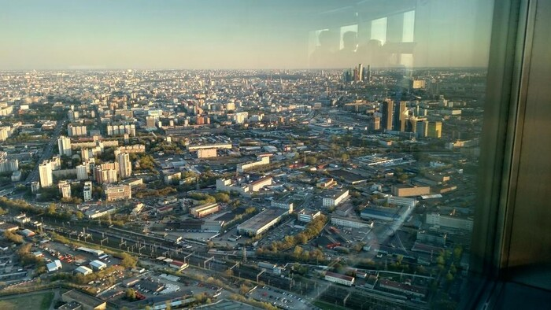

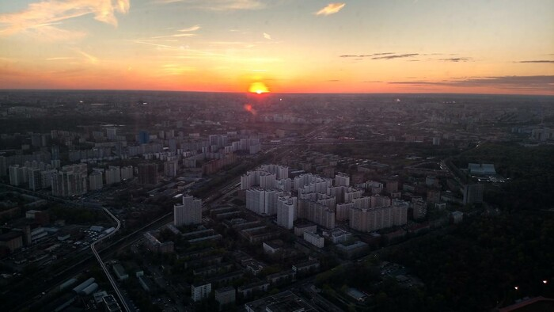

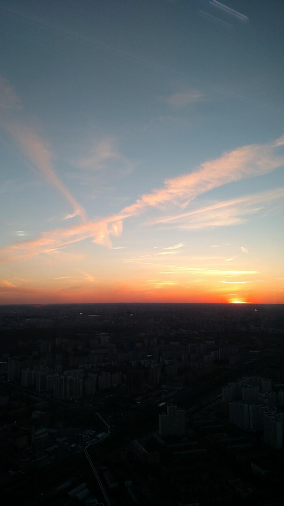

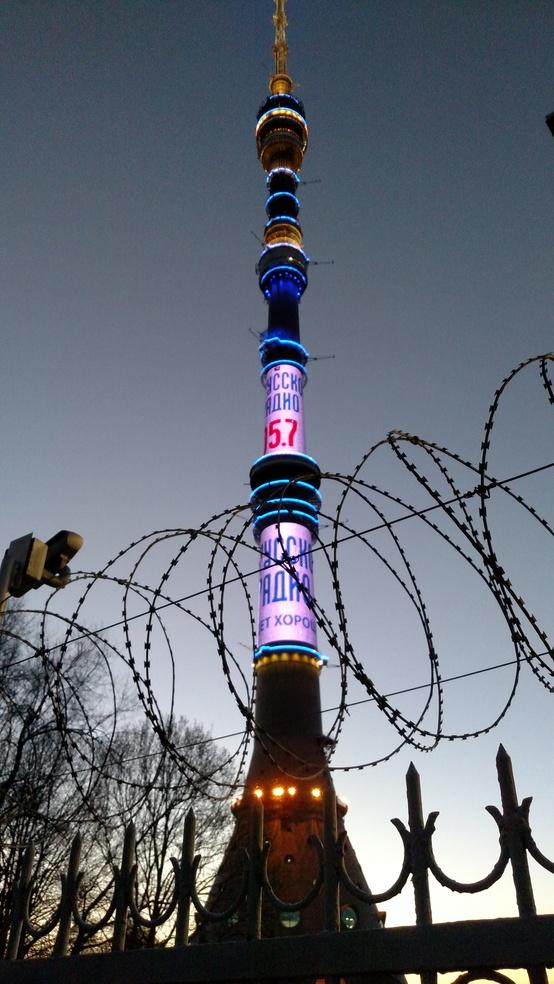

Pasha and American sleep almost twelve hours! American wake up and start
writing log of travels. Now it 2 PM and Ella come home from work for lunch. До
связи!
