Russia and Czechia, Day 10
==========================
Here I am in the Prague airport. I gave myself a little too much wiggle room
getting here, since I took an Uber but timed it based on the public
transportation route. As a result I have a half hour to kill before they'll
even check me in.

Prague is a beautiful city. I arrived at night, and was surprisingly
exhausted. I checked into the hostel and walked around the city briefly,
dodging the men loitering around offering tickets to strip clubs or various
scams. I found a little gyro pizza place and got a slice of pizza. Then it
was back to the hostel and straight to bed.

I got up early and walked across the touristastic Charles Bridge. It
occurred to me that I hadn't charged my phone, so I wouldn't be able to take
pictures. I walked up up up to the top of a big hill that has a tiny Eiffel
Tower on it. It was something of a climb. My phone did allow me one picture:

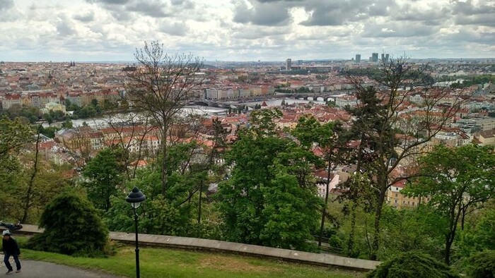

I descended the hill and crossed another bridge back onto the other side of
the city. It was about noon and I was surprised to find nobody anywhere.
Every restaurant I passed was presumably open but completely empty. Since I
was in the mood for some authentic Czech cuisine, I finally decided on a
little Korean place:

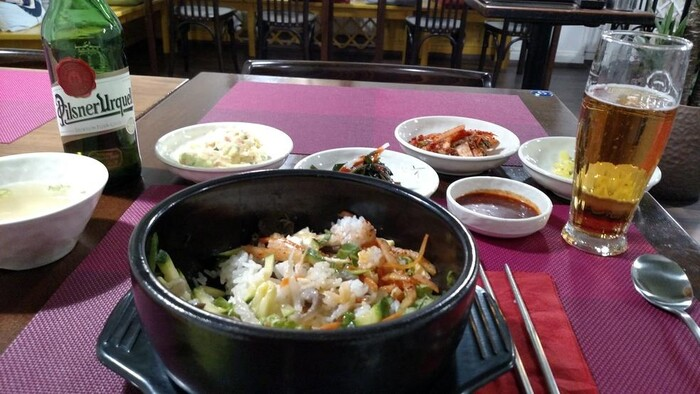

They even allowed me to borrow a phone charger. Just me and the Czech
waitress. Wasn't she a doll. Now I was feeling quite better, and proceeded
to walk around all day until my feet hurt. There was a bunch of stuff, most
of which I didn't photograph (had to conserve phone juice):

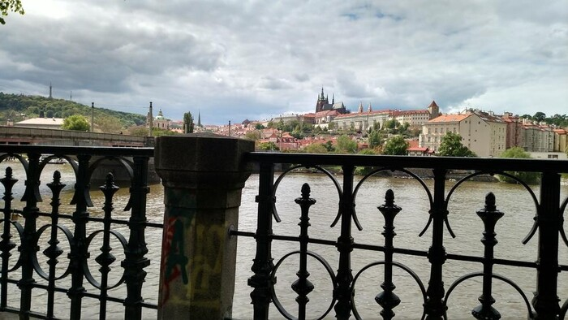

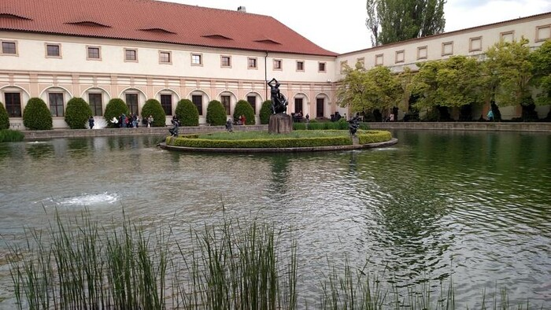

There was a horrible noise coming from that garden place above. Turns out
there are at least three peacocks:

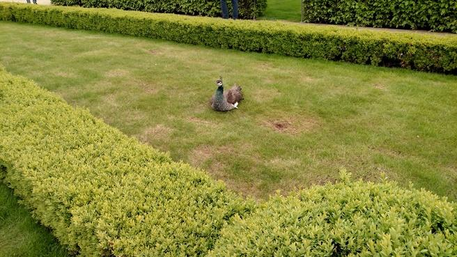

There are plenty of pretty nooks and crannies:

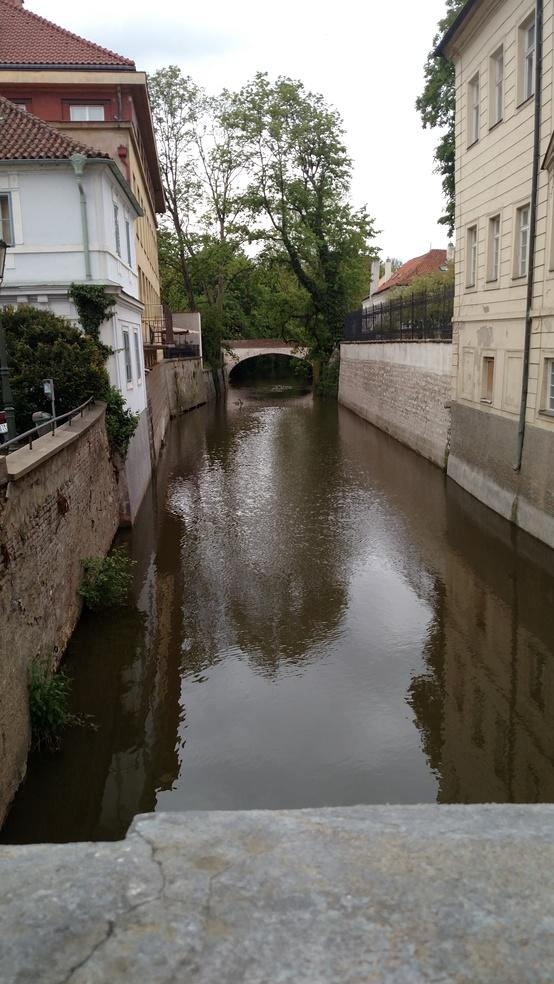

It's better to be there than to see pictures of it, I think. The weather was
nice and the breeze off of the river was chilly, so there was this nice
smell/feel vibe about the whole area.

It wouldn't surprise me if there were more Americans in the hostel than at
my job. Still, predominantly non-American. At breakfast I spoke to two
German guys who were traveling after finishing school. It occurred to me at
some point in the conversation that I had ten years on these guys. I would
have done well to travel earlier, but better late than never.

Also, the backpacking scene is not like sightseeing. It is not uncommon for
a (young) person to leave town with a backpack, a smart phone, and very
little money and pop around between European cities for months at a time.
Here I am with my two day stay!

In the bunk below me was a dreadlocked black guy from Tennessee. At one
point we were at a big music bar and several locals were taking pictures
with him as if he were a celebrity. That night we went out also with two
French travelers – a guy and a girl – and generally there was much
merriment. Tennessee and the two frenchies disappeared after a while, and so
remained me and the Indian-looking Londoner increasingly drunk at the bar,
sitting in front of the band. As far as I could tell, it was a jam band
situation, but the bass player had one of the best ears I've heard in a
while. He clearly didn't know the songs, and it clearly didn't matter
because he was so good at it.

I hadn't planned on going out with people from the hostel that night;
instead I went out by myself with a list of notable beer locations to try
out. The first was an absolute bore – I had one beer and left. On the way
there, though, I had passed an authentic and gritty looking dive bar, so I
sat down there. I think I was a point of mild amusement for some of the
regulars, sitting there with my hoodie and my phone, but I wasn't looking to
talk to any English speakers and was instead just taking in the room (and
the beer). The big fat guy sitting next to me seemed imposing at first, but
after a couple of drinks I saw he had moved down the bar a bit and was
giving one of the women a back massage. Gentle giant.

So I went back to the hostel ready for bed. After all, I had a whole museum
day planned for my last day and didn't want to drink too much! But then Mr.
Tennessee and the two frenchies happened, and I ended up in bed after a
double dose of beer, which left me entirely miserable the next day. Mr.
Tennessee and the frenchies, on the other hand, did not return until the
following morning. Tennessee asked where I went, and I responded, "I was
near the stage, where did you guys run off to?" He replied, "Oh man,
everywhere. I don't even know." I'm glad I didn't follow.

I slept in until eleven or so and then forced my ass out of bed with the
music museum as my destination.

Oh wait, I didn't even tell you about Roger! Roger is Polish. He was sitting
next to me on the flight out of Warsaw into Prague. I was practicing my
"make friends" game, so as soon as we sat down I shook his hand and
introduced myself. Turns out he's a forty-something father of two who
travels among California, Warsaw, and Prague working some job that has
something to do with fiber optic cable. His older daughter is an exchange
student in Mexico. He's building a Summer home on the beach. Anyway, we
chatted on the plane and he told me some spots I could see in Prague. Later
he came up to me at the luggage carousel and offered to share a cab into the
city center, which he would pay for a write off as a business expense.
Thanks, Roger. The funny thing is that the night I was telling you about
before, with all of the beer, I ran into Roger on the street on my way to
the boring bar. He recognized me in the dark and remembered my name. There
is no shortage of good people in this world.

Okay, back to the hangover day. Food was not an option yesterday. I walked
initially along the same route I had taken the previous day: to the river,
across the Charles Bridge, past the tourist horde, up the hill, etc. I then
began to realize that I was actually dying inside. I had my fully charged
phone guide me to the museum of music, which also serves as a recital venue,
and tried to keep the heaving and cold sweats to a minimum. Fortunately I
was literally the only person at the museum. My visit to the men's bathroom
was more like a short nap. Anyway, there was a lot there to interest a music
geek like me, but I photographed relatively little. Here are clarinets
specially built to support quarter tone scales:

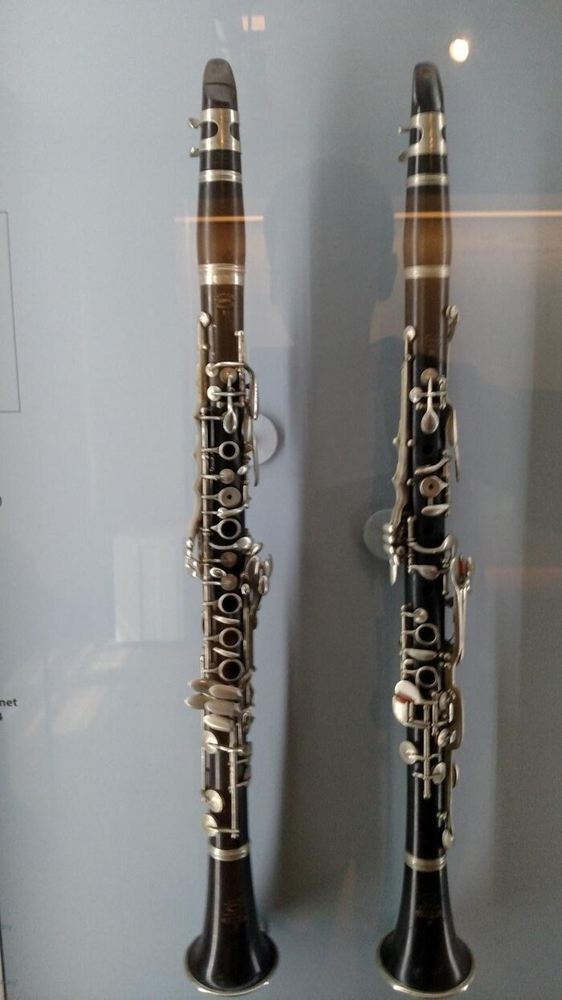

If you have a vague idea of how to play the clarinet, you'll wonder how this
arrangement manages to allow twice as many different notes to be played. Too
bad quarter tone music sounds like shit.

The building itself was interesting. In one of the exhibition rooms, there
was a tiny staircase leading only to a window.

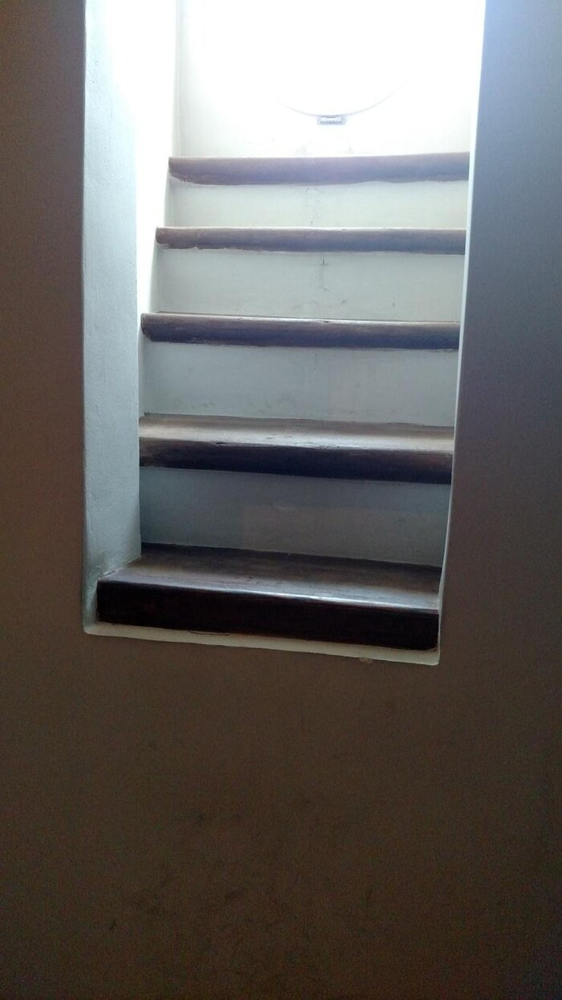

Here is the main room:

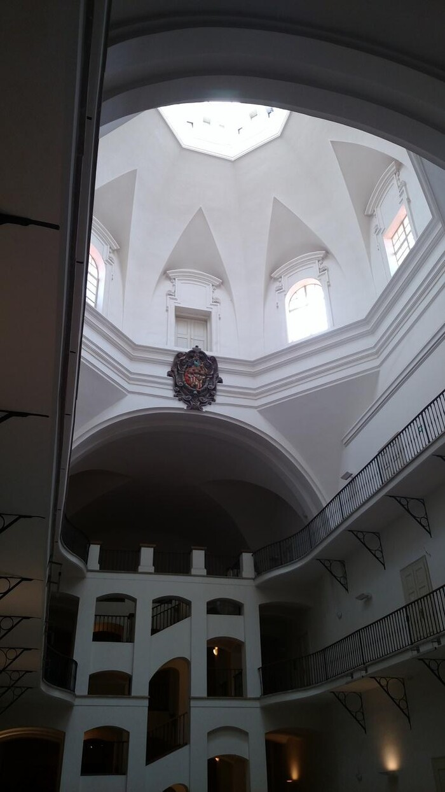

In each room in the permanent exhibit, there's a little chair with two sets
of headphones. The idea is you look at the period instruments and read about
them, and then you can sit down and hear recordings of period music played
on those instruments. They had all kinds of instruments. But there were
hardly any saxophones! For that you need to travel to Paris.

After the museum, I canceled the rest of my afternoon and headed back to the
hostel for a nap. As the sun began to set, the conflict between my inability
to eat and my not having eaten became more urgent. I decided to walk around
the city in search of a bite, and then would eventually end up at the
Charles Bridge again after sunset, since it's supposed to be prettier at
night.

At first I was hurrying out of a restaurant soon after walking in, since the
smell of food hit my brain like a bucket of water hits a sofa. I settled on
a few bites of a enormous hotdogish sausage that I bought from a street
vendor. I knew I wouldn't finish it, but couldn't get myself to throw it
out, so I spent the next half hour or so walking around Prague with a giant
brown penis in my hand, occasionally nibbling on it with a nauseous look on
my face.

But still, life was good. The sun was setting:

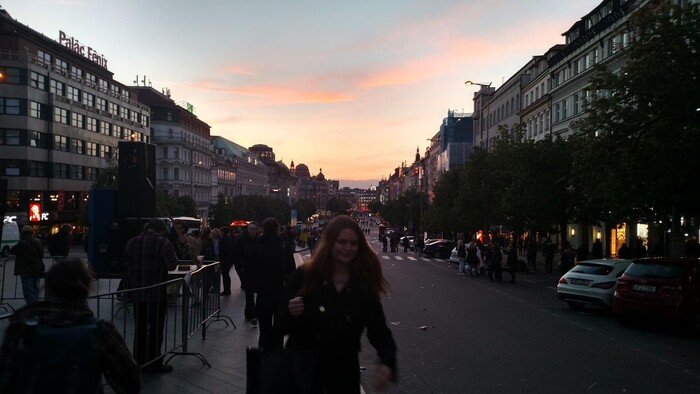

There is a life-sized crucifix on the Charles Bridge:

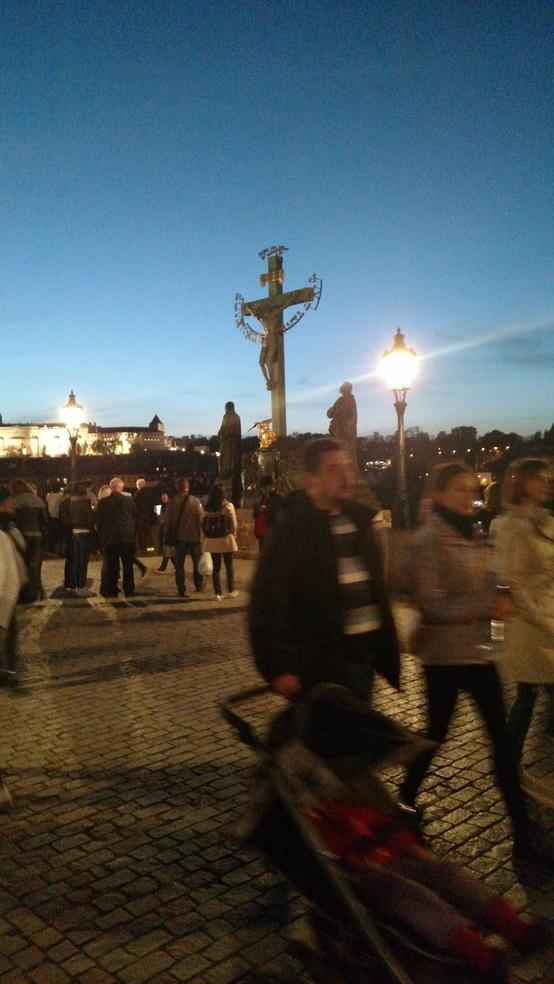

And the city does look great at night, though it's difficult to capture
without better optical control:

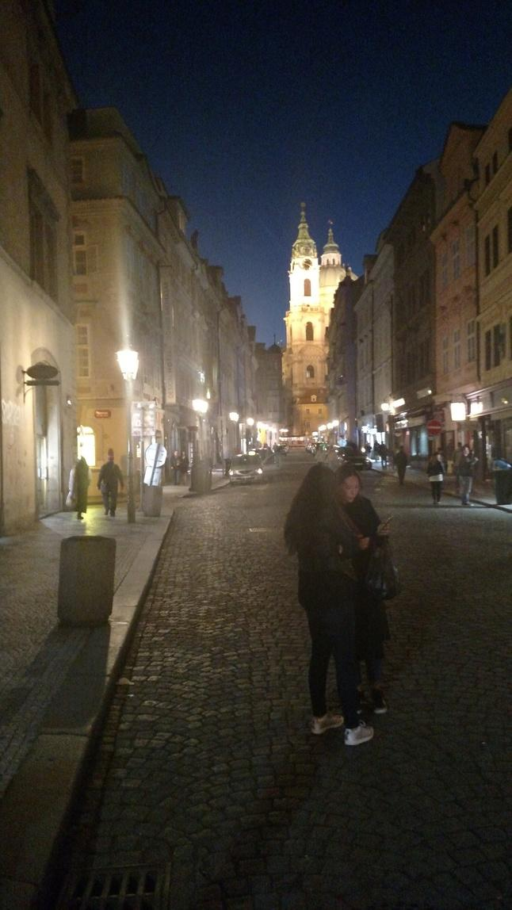

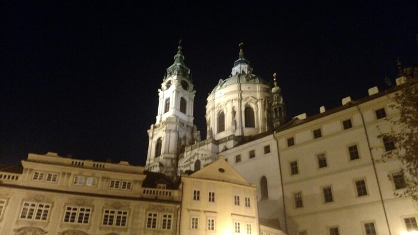

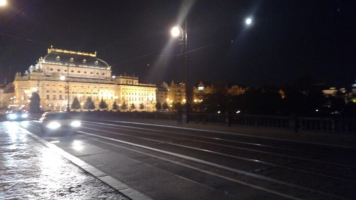

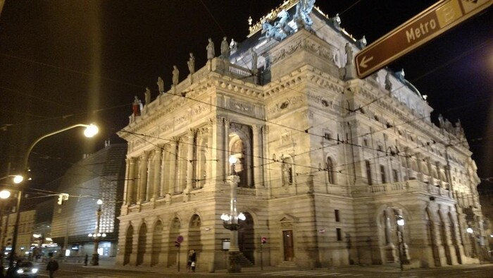

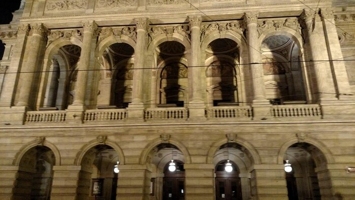

I stopped by a Chinese restaurant on my way back to the hostel, mindful of
how famished I'd be the next morning. Turned out to be a good move. So, I
didn't have any authentic Czech food during my stay (aside from the
hilarious sausage). Next time.

That's about it for my trip. I'm waiting for the plane to arrive here in
Prague. Then it's a few hours in Warsaw, and finally the long ass flight
back to Newark. Ahoy!
