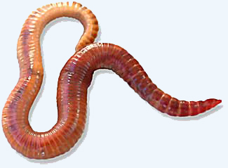
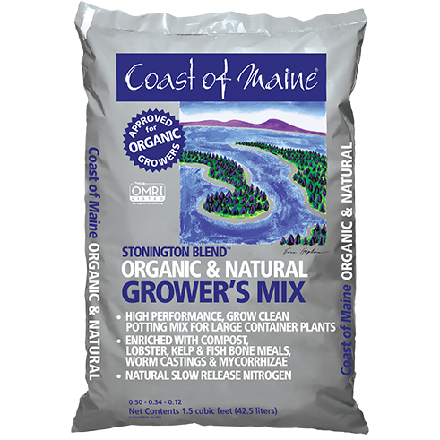

Vermicompost Is Worm Poop
=========================
My dad recently pointed out that we're all basically worms.

Niches have filled and tissues have specialized, but the overall body plan is
the same. Food goes in one hole, and comes out the other.  Fatty outer casing.
Bilateral symmetry.  Fun sexy bits.  Worms.

 
*This is you.*

The body plan wouldn't work in two dimensions.  How could you connect the
inside parts to the outside parts without blocking either the mouth or the
anus?  Others have imagined a zipper-like mechanism where the flat animal is
zipped shut except for in cavities of food that propagate backwards.  I don't
know whether nature could produce such an organ.  I also don't know whether a
universe could exist in two dimensions.

Fortunately, we live in at least three dimensions, and the food that comes out
is called poop, except that when it comes out of a worm, it's called
"castings."  This is strange, because the "cast" left by the worm is the void
in the soil due to the worm's having eaten through it, not the resulting poop.
My guess is that it sounds better than "poop," and we can't call them
"droppings," can we?

Compost
-------
I tried composting, it's harder than it sounds.

1. Put organic stuff in a pile.
2. Keep the carbon to nitrogen ratio of the contents within certain bounds.
3. Keep the pile aerated so that aerobic bacteria proliferate instead of the
   stinky stinky anaerobic bacteria.
4. Keep animals away from the pile.
5. Wait a long time.  If there's a lot of stuff, it'll heat up and go faster.

(1) was a five gallon bucket on the roof.  (4) was a loosely fit lid on the
bucket.  (5) wasn't a problem because I wasn't in a hurry.

(2) and (3) are the hard parts.  I inoculated some used potting soil with over
ten pounds of spent malted barley from a batch of beer that I had brewed.
That's _way_ too much nitrogen.  The bacteria went apeshit, liquefied the
organic mass, which then became compacted in the bucket, and so went anaerobic,
i.e. septic.

I took a peek under the lid about a month later, and there were mushrooms
sprouting from the surface.  There were also hundreds of flies, wriggling
maggots, and various crawling insects.

Yeah, I could have mixed in more shredded cardboard, and I could have stirred
the pile regularly to keep it aerated, but who could be bothered?  The roof is
far.

It's been a good while since then, so that now the compost has mostly
stabilized.  It smells like ammonia, and the pH is way too high.  Never again.

Vermicompost
------------
I read an article online that said compost is for suckers.  [Vermicompost][1]
is where it's at.

The pitch goes like this.  Why wait months for the simplest known organisms to
microscopically chew away at your food scraps?  Instead, get something with a
real mouth to chew away at your food scraps, right now.

Think about it.  It takes your body a couple of days to turn food into brown
biomass.  Days, not months.  But your brown biomass is nasty.  Primates are
terrible.  A [red wiggler worm][2], on the other hand, puts out its entire body
weight in poop _every day_, and the resulting "castings" have no foul odor.

It's not just randos on the internet, either.

Here's one of the bottles of liquid fertilizer that I bought:

It's shouting right there on the bottle:

> **EARTHWORM CASTINGS** & BAT GUANO

The company whose soil I'm using this season, Cost of Maine, also makes a
special cannabis-specific potting soil called "Stonington Blend."

> This soil incorporates mycorrhizal fungi, kelp, fish bone and alfalfa meal, as well as **worm castings**, peat, coir and lobster compost. When growing in 15 gallon containers,  there is no need for additional nutrients.

Fifteen gallons?  I'm growing in a crawl space, people.

Finally, there's a company called [Build a Soil][3] that's become popular due
in part to a YouTube channel hosted by the company's CEO, where he proselytizes
for The Gospel of Organic No-Till Living Soil Cannabis Gardening.  I grow in
tiny pots of mediocre soil amended with chemical fertilizers, but his insight
is still helpful.  Here's what he has to say about adding solid organic
fertilizer to the top of the soil:

> There are many ways to approach top dressing a plant but here is a method that I really like. 
>
> For every 5 Gallons the plant is in I would add the following:
>
> 1.  1 Tablespoons Kelp Meal
> 2.  2 Tablespoons Fish Bone Meal
> 3.  4 Tablespoons Gypsum
> 4. Cover with up to 1/2" - 1" layer of **worm castings** across the whole container.
> 5. Put the mulch back, or cover with fresh mulch etc. 

These people love worm poop.  It's all the rage.  Let's make some.

Roommates
---------
The [LES Ecology Center][4] will sell you some worms, just call (212)-477-4022
to order in advance and then pick up at one of their farmers' market tents in
Union Square or Tomkins Square Park.

I called and they told me that the worms are done this year.  Call back next Spring.

So, I ordered worms online.  [Uncle Jim's Worm Farm][5] will ship you a
drawstring bag of 500 worms from Pennsylvania for $45.

You can't just keep them in a bag, though.  I bought some more five gallon
plastic buckets from the local hardware store, and built a worm bin.

Here's the idea.  One of the buckets has a bunch of holes in the bottom and
along the rim.  You line the bottom with some newspaper and fill it a few
inches deep with wetted shredded paper and food scraps.  The worms live in
there.  The lid goes on, itself with holes, and also I put a cut up t-shirt
under the lid to discourage fruit flies.  That bucket then stacks inside of a
bucket without holes, to catch any liquid that gets through the newspaper and
out the bottom holes.

Feed the worms at least once a week.

Here's the cool part.  What about when you want to harvest the poop from the
worms?  Do you go digging through the poop, picking out worms with your hands
like a barbarian?

No, you don't.  Instead, you have another bucket with holes.  You put fresh
food and bedding into the new bucket and place it on top of the old.  The
worms, running out of food in their bucket, will wiggle their way up into the
top bucket.  After a few days, you harvest the castings from the first bucket,
dump the contents of the new bucket (worms and all) back into the first bucket,
and you're ready to make another batch of worm poop.  Brilliant!

The worms arrived just this morning.  Here they are squirming in their new home
of shredded paper, trimmed cannabis leaves, and spent coffee grounds:

Let the pooping begin.

[1]: https://en.wikipedia.org/wiki/Vermicompost
[2]: https://en.wikipedia.org/wiki/Eisenia_fetida
[3]: https://buildasoil.com/
[4]: https://www.lesecologycenter.org/products/
[5]: https://unclejimswormfarm.com/
